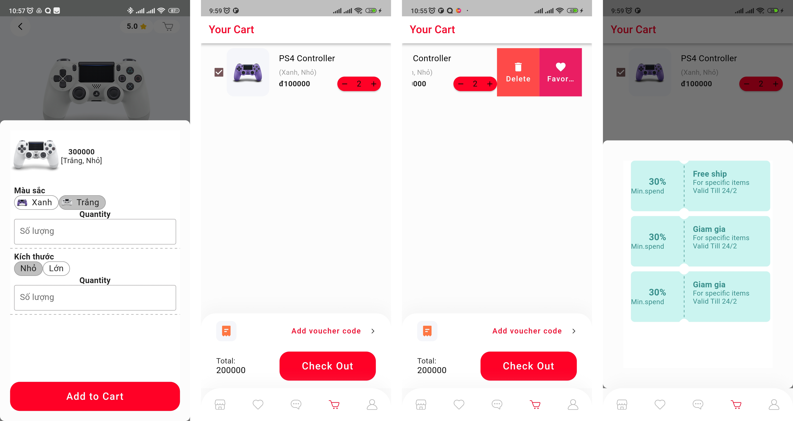

#  PHÂN TÍCH VÀ THIẾT KẾ

## TÁC NHÂN HỆ THỐNG

Hệ thống sẽ bao gồm 3 tác nhân chính:

-   Người mua hàng: Là tác nhân chính, chỉ có khả năng tương tác giao
    diện khách của hệ thống, người mua hàng sẽ thông qua phần giao diện
    khách này để thao tác và giải quyết yêu cầu. Tác nhân này có quyền
    sử dụng hệ thống để mua, đánh giá sản phẩm, gửi phản hồi sản phẩm,
    đặt mua sản phẩm, thanh toán, ...

-   Người bán hàng: Là những người có khả năng đăng bán sản phẩm của bản
    thân và hiển thị sản phẩm đó lên phía khách hàng để thực hiện buôn
    bán. Họ có các khả năng quản lý đơn hàng, quản lý hàng hóa, xem
    thống kê, ...

-   Người quản trị: Họ là những người quản trị của hệ thống, có khả năng
    quản lý người dùng, quản lý mã giảm giá, ...

## YÊU CẦU CHỨC NĂNG

1.  Người mua hàng

### Xem chi tiết sản phẩm, thông tin sản phẩm

-   Mô tả: Khách hàng sẽ có khả năng xem sản phẩm, thông tin sản phẩm
    thông qua giao diện của người dùng, chức năng sẽ hiển thị các thông
    tin như: hình ảnh, tên sản phẩm, chi tiết sản phẩm, đánh giá sản
    phẩm và nhận xét của người mua.

-   Đầu vào: Mã ID của sản phẩm mà người dùng lựa chọn thông qua giao
    diện.

-   Xử lý: Tìm kiếm trên cơ sở dữ liệu và trả kết quả là dữ liệu chi
    tiết của sản phẩm.

-   Đầu ra: Giao diện chi tiết thông tin sản phẩm.

### Xem các sản phẩm

-   Mô tả: Khách hàng sẽ có khả năng các sản phẩm ở màn hình chính của
    giao diện, các sản phẩm này sẽ được hiện dựa trên các danh mục khác
    nhau như nội thất...

-   Đầu vào: Không.

-   Xử lý: Xác định các sản phẩm sẽ hiển thị.

-   Đầu ra: Giao diện danh sách các sản phẩm.

### Gửi phản hồi sản phẩm

-   Mô tả: Sau khi người dùng đặt mua, họ có thể gửi phản hồi, nhận xét
    sản phẩm.

-   Đầu vào: Thông tin phản hồi của người dùng, ID của sản phẩm.

-   Xử lý: Lưu thông tin phản hồi của sản phẩm dựa trên ID, thông tin sẽ
    được gửi cho người bán.

-   Đầu ra: Thông báo phản hồi thành công.

### Đặt hàng vào giỏ

-   Mô tả: Sau khi người dùng xem thông tin sản phẩm, họ có quyết định
    lựa chọn đặt hàng vào giỏ để tiếp tục xem hàng.

-   Đầu vào: ID sản phẩm.

-   Xử lý: Lập thông tin giỏ hàng, lưu ID sản phẩm vào giỏ hàng.

-   Đầu ra: Không.

### Đặt mua sản phẩm

-   Mô tả: Sau khi người dùng nhấn vào thông tin sản phẩm, họ có thể đặt
    mua sản phẩm và tiến hành thanh toán.

-   Đầu vào: Mã ID danh sách các sản phẩm, địa chỉ nhận hàng, các thông
    tin bổ sung phụ thuộc vào sản phẩm như số lượng, màu sắc... và các
    thông tin khác mà người dùng nhắn gửi.

-   Xử lý: Tiến hành lưu trữ phiên đặt hàng, gửi thông báo đến bên người
    bán hàng, thực hiện tính toán ước lượng các thông tin như thời gian
    giao hàng...

-   Đầu ra: Thông báo thành công, hiển thị giai đoạn tiếp theo.

### Thanh toán

-   Mô tả: Người dùng có thể chọn phương pháp thanh toán và tiến hành
    thanh toán.

-   Đầu vào: Phương thức thanh toán mà người dùng lựa chọn.

-   Xử lý: Khởi động dịch vụ thanh toán bên phía thứ ba, tiến hành thanh
    toán.

-   Đầu ra: Kết quả thông báo của phiên thanh toán.

### Tìm kiếm sản phẩm bằng hình ảnh

-   Mô tả: Người dùng có thể chọn hình ảnh và dựa vào hình ảnh đó để tìm
    kiếm sản phẩm trên hệ thống.

-   Đầu vào: Dữ liệu mà người dùng muốn tìm dưới dạng hình ảnh, có thể
    thông qua các phương tiện như camera, album.

-   Xử lý: Tiến hành xác định đối tượng của hình ảnh, dựa trên đối tượng
    này tìm kiếm dữ liệu bên phía cơ sở dữ liệu.

-   Đầu ra: Danh sách các sản phẩm có liên quan đến hình ảnh mà người
    dùng nhập vào.

### Tìm kiếm sản phẩm bằng giọng nói

-   Mô tả: Người dùng có thể thông qua giọng nói để tìm kiếm sản phẩm mà
    bản thân mong muốn.

-   Đầu vào: Giọng nói thông qua thiết bị đầu vào của người dùng.

-   Xử lý: Thực hiện xác định đối tượng tìm kiếm.

-   Đầu ra: Danh sách các sản phẩm có liên quan đến âm thanh mà người
    dùng nhập vào.

### Đánh giá sản phẩm

-   Mô tả: Sau khi người dùng đặt mua sản phẩm, họ có quyền thực hiện
    đánh giá sản phẩm.

-   Đầu vào: Dữ liệu đánh giá mà người dùng nhập vào, ID sản phẩm.

-   Xử lý: Thực hiện lưu trữ thông tin đánh giá sản phẩm.

-   Đầu ra: Thông báo thành công, đánh giá sẽ được hiển thị ở phần đánh
    giá.

    1.  Người bán hàng

### Thống kê

-   Thống kê số đặt hàng

```{=html}
<!-- -->
```
-   Mô tả: Hệ thống sẽ thống kê các đơn hàng có trong ngày, dữ liệu hàng
    hoá trong ngày

-   Đầu vào: Yêu cầu (request) của người dùng.

-   Xử lý: Thực hiện truy vấn dữ liệu.

-   Đầu ra: Dữ liệu thống kê số đặt hàng.

```{=html}
<!-- -->
```
-   Thống kê các sản phẩm

```{=html}
<!-- -->
```
-   Mô tả: Hệ thống sẽ thống sẽ thống kê các dữ liệu bao gồm số lượng
    các sản phẩm, các sản phẩm hết hàng, các sản phẩm được đặt nhiều hôm
    nay.

-   Đầu vào: Yêu cầu (request) của người dùng.

-   Xử lý: Thực hiện truy vấn dữ liệu.

-   Đầu ra: Dữ liệu thống kê các sản phẩm.

### Quản lý hàng hóa

-   Tạo danh mục sản phẩm

```{=html}
<!-- -->
```
-   Mô tả: Người bán sẽ có khả năng chọn danh mục sản phẩm cửa hàng hóa
    mà họ muốn bán.

-   Đầu vào: Thông tin về danh mục sản phẩm.

-   Xử lý: Thực hiện lưu trữ thông tin.

-   Đầu ra: Thông báo thành công.

```{=html}
<!-- -->
```
-   Tạo sản phẩm

```{=html}
<!-- -->
```
-   Mô tả: Người bán sẽ tạo ra các sản phẩm và thông tin của các sản
    phẩm đó.

-   Đầu vào: Thông tin về sản phẩm cần tạo.

-   Xử lý: Thực hiện lưu trữ thông tin thông tin sản phẩm mới.

-   Đầu ra: Thông báo thành công.

```{=html}
<!-- -->
```
-   Chỉnh sửa sản phẩm

```{=html}
<!-- -->
```
-   Mô tả: Người bán sẽ có thể chỉnh sửa thông tin của sản phẩm.

-   Đầu vào: Thông tin về sản phẩm mới.

-   Xử lý: Thực hiện lưu trữ thông tin thông tin sản phẩm mới.

-   Đầu ra: Thông báo thành công.

```{=html}
<!-- -->
```
-   Tạo mã voucher, mã giảm giá

```{=html}
<!-- -->
```
-   Mô tả: Người dùng sẽ tạo mã voucher, mã giảm giá cũng như xóa mã
    giảm giá đó

-   Đầu vào: Thông tin về mã voucher

-   Xử lý: Thực hiện lưu trữ thông tin

-   Đầu ra: Thông báo thành công

```{=html}
<!-- -->
```
-   Xóa sản phẩm

```{=html}
<!-- -->
```
-   Mô tả: Người dùng có thể xóa sản phẩm Đầu vào: Thông tin về sản phẩm
    cần tạo

-   Đầu vào: ID của sản phẩm

-   Xử lý: Thực hiện xóa sản phẩm

-   Đầu ra: Thông báo thành công

### Quản lý đơn hàng

-   Tiếp nhận đơn hàng

```{=html}
<!-- -->
```
-   Mô tả: Sau khi người bán thấy đơn hàng, họ có thể lựa chọn tiếp nhận
    đơn hàng

-   Đầu vào: ID của giao dịch

-   Xử lý: Thực hiện xác nhận giao dịch, gửi thông báo đến người dùng

-   Đầu ra: Thông báo thành công

```{=html}
<!-- -->
```
-   Từ chối đơn hàng

```{=html}
<!-- -->
```
-   Mô tả: Người bán có thể từ chối đơn đặt hàng và đưa ra lý do từ chối
    cần thiết

-   Đầu vào: ID của giao dịch

-   Xử lý: Thực hiện từ chối giao dịch, gửi thông báo đến người dùng

-   Đầu ra: Thông báo từ chối thành công

```{=html}
<!-- -->
```
-   Giao tiếp với khách hàng về đơn hàng

```{=html}
<!-- -->
```
-   Mô tả: Người dùng có thể thông qua kênh giao tiếp với khách hàng để
    tương tác và trao đổi thông tin

-   Đầu vào: ID của người bán, ID của người mua, dữ liệu tin nhắn

-   Xử lý: Thực hiện khởi tạo phòng trò chuyện, lưu trữ tin nhắn dựa
    trên mã phòng

-   Đầu ra: Thông báo gửi thành công

    1.  Admin

### Quản lý người dùng

-   Mô tả: Người quản trị viên sẽ có khả năng quản lý các người dùng
    trong hệ thống, bao gồm việc phân quyền, chọn người có quyền bán,
    xóa, cấm người dùng

-   Đầu vào: ID của người dùng, quyền (vai trò) của người dùng

-   Xử lý: Thực hiện thay đổi, lưu dữ liệu lại

-   Đầu ra: Thông báo thay đổi thành công

### Quản lý voucher, mã giảm giá, ...

-   Mô tả: Người quản trị viên có khả năng tạo ra mã giảm giá và quản lý
    mã giảm giá

-   Đầu vào: Thông tin mã giảm giá

-   Xử lý: Lưu trữ mã giảm giá

-   Đầu ra: Thông báo thêm, xóa, chỉnh sửa thành công

    1.  Cá nhân hóa

### Đăng nhập

-   Mô tả: Hệ thống sẽ lưu trữ và định danh người dùng thông qua hình
    thức đăng nhập

-   Đầu vào: Thông tin đăng nhập

-   Xử lý: Thực hiện tìm kiếm trên cơ sở dữ liệu

-   Đầu ra: Thông báo, token để quản lý đăng nhập

### Chỉnh sửa, lưu trữ dữ liệu cá nhân

-   Mô tả: Hệ thống sẽ thông qua hình thức đăng nhập để lưu trữ dữ liệu
    cá nhân của người dùng

-   Đầu vào: ID của người dùng, dữ liệu cá nhân

-   Xử lý: Thực hiện truy vấn và lưu trữ trên cơ sở dữ liệu

-   Đầu ra: Thông báo thành công

    1.  Phi chức năng

### Đa ngôn ngữ

-   Mô tả: Hệ thống hỗ trợ đa ngôn ngữ.

-   Đầu vào: Lựa chọn ngữ

-   Xử lý: Chuyển đổi ngôn ngữ, khởi động lại chương trình

-   Đầu ra: Thông báo thành công

    1.  Các tính năng khác

### Đánh giá mức độ uy tín của shop bán hàng

-   Mô tả: Hệ thống sẽ thực hiện đánh giá mức độ uy tín của Shop bán
    hàng dựa trên các thông tin của Shop, bao gồm số lượng mua hàng, số
    giao dịch hoàn tất, đánh giá của người dùng.

-   Đầu vào: Dữ liệu của Shop

-   Xử lý: Thực hiện tính toán dựa trên thuật toán và lưu tại cơ sở dữ
    liệu

-   Đầu ra: Không

### Đánh giá mức độ ưu tiên hiển thị của sản phẩm

-   Mô tả: Hệ thống sẽ sử dụng mức độ uy tín của shop cùng với thói quen
    của người dùng để hiển thị các sản phẩm trên màn hình.

-   Đầu vào: Mức độ uy tín, dữ liệu người dùng

-   Xử lý: Thực hiện tính toán dựa trên thuật toán

-   Đầu ra: Không

### Xác định thói quen của người dùng

-   Mô tả: Hệ thống sẽ xác định thói quen của người dùng dựa trên các
    hoạt động thường xuyên của người dùng, các sản phẩm hay mua\...

-   Đầu vào: Dữ liệu của người dùng

-   Xử lý: Thực hiện tính toán dựa trên thuật toán

-   Đầu ra: Không

### Mã hóa mật khẩu, tài khoản

-   Mô tả: Hệ thống sẽ thực hiện mã hóa mật khẩu dưới dạng các token và
    lưu nó vào trong cơ sở dữ liệu

-   Đầu vào: Dữ liệu của người dùng

-   Xử lý: Thực hiện tính toán dựa trên thuật toán

-   Đầu ra: Không

## GIẢI PHÁP

Về phía Client:

-   Hệ thống sẽ sử dụng Flutter để xây dựng giao diện cho phần client
    của hệ thống

-   Sử dụng thư viện Bloc để quản lý các tình trạng (state) của giao
    diện

-   Sử dụng HTTP Request để giao tiếp với Server

Về phía Server:

-   Hệ thống sử dụng Node.JS, Express.JS để xây dựng các API

-   Lưu trữ dữ liệu với MongoDB

-   Sử dụng Firebase cho chức năng thông báo

## PHÂN TÍCH VÀ THIẾT KẾ HỆ THỐNG

1.  Sơ đồ Use-Case

### Sơ đồ UseCase tổng quát

{width="6.295138888888889in"
height="5.379166666666666in"}

Hình .: Sơ đồ UseCase mức độ cao nhất

Sơ đồ có 4 actor cơ bản tương tác với hệ thống bao gồm:

-   Người mua hàng (Người dùng cơ bản): Họ là những người đã đăng ký tài
    khoản, có quyền mua hàng. Họ tương tác với hệ thống bằng việc xem
    sản phẩm, mua hàng, thanh toán. Ngoài ra họ có khả năng đăng ký
    quyền bán hàng. Trong đó, để thực thi tính năng mua hàng, họ phải
    xem sản phẩm và thanh toán.

-   Người bán hàng: họ là những người sở hữu quyền bán hàng, họ tương
    tác với hệ thống thông qua việc xem sản phẩm, mua hàng, thanh toán
    như người mua hàng. Điểm khác biệt đó chính là họ có khả năng quản
    lý cửa hàng của bản thân

-   Admin: họ là những người quản trị, họ có quyền quản lý ứng dụng

-   Khách chưa đăng nhập: Họ là những người dùng sử dụng hệ thống khi
    chưa đăng nhập, họ có thể tương tác với hệ thống thông qua việc xem
    sản phẩm cũng như đăng ký tài khoản, tuy nhiên họ không thể mua hàng
    cũng như thanh toán

### Sơ đồ UseCase chi tiết hóa chức năng

{width="6.295138888888889in"
height="2.9451388888888888in"}

Hình .: Sơ đồ UseCase chi tiết hóa chức năng xem sản phẩm

Tại sơ đồ này, ta có thấy khi Xem sản phẩm, người dùng có khả năng Tìm
kiếm sản phẩm, Xem sản phẩm khuyến nghị, Thêm vào giỏ và Thêm vào sản
phẩm ưu thích. Trong đó, khi Tìm kiếm sản phẩm, người dùng có thể Tìm
kiếm sản phẩm bằng hình ảnh hoặc tìm kiếm sản phẩm bằng giọng nói. Với
chức năng xem sản phẩm khuyến nghị, người dùng cần phải Xác thực người
dùng. Còn đối với chức năng Thêm vào giỏ, người dùng có thể Xác thực
người dùng thông qua Dịch vụ đăng nhập. Đối với chức năng Thêm vào sản
phẩm ưu thích, người dùng cần phải Xác thực người dùng để thực hiện chức
năng này.

{width="6.295138888888889in"
height="3.8069444444444445in"}

Hình .: Sơ đồ UseCase chi tiết hóa chức năng thanh toán

Tại sơ đồ này, ta có thấy khi Thanh toán, hệ thống bắt buộc phải Xác
thực người dùng (có thể thực hiện bằng Đăng nhập bằng Google hoặc Đăng
nhập bằng tài khoản hệ thống, cả hai cách này đều được Dịch vụ đăng nhập
cung cấp), Cập nhật giỏ hàng, Tính toán tổng giá, Tính toán thuế và bắt
đầu Thực hiện chi trả. Thực hiện chi trả sẽ được thực thi thông qua Dịch
vụ thanh toán.

{width="6.295138888888889in"
height="3.8854166666666665in"}

Hình .: Sơ đồ UseCase chi tiết hóa chức năng phần quản lý cửa hàng

Tại sơ đồ này, ta có thấy với Quản lý cửa hàng, điều đầu tiên ta cần
phải làm đó chính là Xác thực người dùng. Với Quản lý cửa hàng, ta có
thể thực hiện Xem thông tin thống kê với các Thống kê các đơn đặt hàng,
Thống kê sản phẩm. Ngoài ra còn có thể Quản lý hàng hóa với việc Tạo
danh mục sản phẩm, CRUD sản phẩm, CRUD mã giảm giá. Quản lý đơn hàng,
Người bán hàng phải bắt buộc phản phản hồi đơn hàng, Người bán có thể
phản hồi Tiếp nhận đơn hàng hoặc Từ chối đơn hàng. Với từ chối đơn hàng,
họ phải Giao tiếp với khách hàng về đơn hàng. Bên cạnh đó, họ cũng có
thể chủ động Giao tiếp với khách hàng về đơn hàng.

{width="6.094339457567804in"
height="2.9243055555555557in"}

Hình .: Sơ đồ UseCase chi tiết hóa chức năng quản lý ứng dụng

Đối với Quản lý ứng dụng, người dùng có thể Quản lý người dùng với việc
CRUD vai trò của người dùng, Xóa hoặc cấm người dùng. Ngoài ra, họ có
thể CRUD mã giảm giá.

1.  Đặc tả Use-Case

### Nhóm UseCase liên quan sản phẩm

-   Xem sản phẩm:

Bảng .: Đặc tả Use Case xem sản phẩm

<table>
<colgroup>
<col style="width: 7%" />
<col style="width: 18%" />
<col style="width: 73%" />
</colgroup>
<thead>
<tr class="header">
<th>STT</th>
<th>Tên UseCase</th>
<th>Xem sản phẩm</th>
</tr>
</thead>
<tbody>
<tr class="odd">
<td>1</td>
<td>Mô tả</td>
<td>Khách hàng sẽ có khả năng các sản phẩm ở màn hình chính của giao
diện, các sản phẩm này sẽ được hiện dựa trên các danh mục khác nhau như
nội thất…</td>
</tr>
<tr class="even">
<td>2</td>
<td>Tác nhân</td>
<td>Người bán hàng, Người mua hàng, Khách chưa đăng nhập</td>
</tr>
<tr class="odd">
<td>3</td>
<td>Mức độ ưu tiên</td>
<td>Bắt buộc có</td>
</tr>
<tr class="even">
<td>4</td>
<td>Điều kiện kích hoạt</td>
<td>Khi người dùng muốn xem thông tin sản phẩm và nhấn vào một sản phẩm
nhất định</td>
</tr>
<tr class="odd">
<td>5</td>
<td>Điều kiện cần</td>
<td><p>Thiết bị của người dùng đang kết nối internet</p>
<p>Người dùng đã mở app</p></td>
</tr>
<tr class="even">
<td>6</td>
<td>Những thứ xuất hiện sau</td>
<td>Thông tin sản phẩm được hiển thị</td>
</tr>
<tr class="odd">
<td>7</td>
<td>Luồng sự kiện chính</td>
<td><p>1. Người dùng mở app, app sẽ hiển thị trang Trang chủ với các sản
phẩm được hiển thị</p>
<p>2. Người dùng nhấn vào một sản phẩm</p>
<p>3. Hệ thống xác thực mã sản phẩm và bắt đầu tìm kiếm trên cơ sở dữ
liệu</p>
<p>4. Hệ thống trả dữ liệu về và hiển thị</p></td>
</tr>
<tr class="even">
<td>8</td>
<td>Luồng sự kiện thay thế</td>
<td><p>2a. Người dùng nhấn vào nút tìm kiếm</p>
<p><em>Use Case tiếp tục Use Case tìm kiếm sản phẩm</em></p>
<p>2b. Người dùng nhấn mục xem sản phẩm khuyến nghị</p>
<p><em>Use Case tiếp tục Use Case xem sản phẩm khuyến nghị</em></p></td>
</tr>
<tr class="odd">
<td>9</td>
<td>Luồng ngoại lệ</td>
<td><p>3c. Hệ thống xác thực sản phẩm không tồn tại</p>
<p>3c1. Hệ thống trả về thông báo lỗi</p>
<p>3d. Hệ thống bị lỗi</p>
<p>3d1. Hệ thống trả về thông báo lỗi</p></td>
</tr>
</tbody>
</table>

-   Tìm kiếm sản phẩm:

Bảng .: Đặc tả Use Case tìm kiếm sản phẩm

<table>
<colgroup>
<col style="width: 7%" />
<col style="width: 24%" />
<col style="width: 67%" />
</colgroup>
<thead>
<tr class="header">
<th>STT</th>
<th>Tên UseCase</th>
<th>Tìm kiếm sản phẩm</th>
</tr>
</thead>
<tbody>
<tr class="odd">
<td>1</td>
<td>Mô tả</td>
<td>Người dùng có thể tìm kiếm sản phẩm để xác định sản phẩm mình
muốn</td>
</tr>
<tr class="even">
<td>2</td>
<td>Tác nhân</td>
<td>Người bán hàng, Người mua hàng, Khách chưa đăng nhập</td>
</tr>
<tr class="odd">
<td>3</td>
<td>Mức độ ưu tiên</td>
<td>Bắt buộc có</td>
</tr>
<tr class="even">
<td>4</td>
<td>Điều kiện kích hoạt</td>
<td>Khi người dùng muốn tìm kiếm thông tin</td>
</tr>
<tr class="odd">
<td>5</td>
<td>Điều kiện cần</td>
<td><p>Thiết bị của người dùng đang kết nối internet</p>
<p>Người dùng đã mở app</p></td>
</tr>
<tr class="even">
<td>6</td>
<td>Những thứ xuất hiện sau</td>
<td>Danh sách sản phẩm có liên quan được hiển thị</td>
</tr>
<tr class="odd">
<td>7</td>
<td>Luồng sự kiện chính</td>
<td><p>1. Người dùng nhấn vào nút tìm kiếm</p>
<p>2. Người dùng nhấn vào dữ liệu là tên của sản phẩm trên trường nhập
dữ liệu</p>
<p>3. Hệ thống sử dụng dữ liệu tìm kiếm trên cơ sở dữ liệu</p>
<p>4. Hệ thống trả về danh sách kết quả và hiển thị</p></td>
</tr>
<tr class="even">
<td>8</td>
<td>Luồng sự kiện thay thế</td>
<td><p>2a. Người dùng nhấn vào nút tìm kiếm và nhấn vào biểu tượng cái
míc</p>
<p><em>Use Case tiếp tục Use Case tìm kiếm sản phẩm bằng giọng
nói</em></p>
<p>2b. Người dùng nhấn vào nút tìm kiếm và nhấn vào biểu tượng máy
ảnh</p>
<p><em>Use Case tiếp tục Use Case tìm kiếm sản phẩm bằng hình
ảnh</em></p></td>
</tr>
<tr class="odd">
<td>9</td>
<td>Luồng ngoại lệ</td>
<td><p>3c. Hệ thống không tìm kiếm được bất cứ sản phẩm nào có nội dung
tương tự</p>
<p>3c1. Hệ thống trả về thông báo</p>
<p>3d. Hệ thống bị lỗi</p>
<p>3d1. Hệ thống trả về thông báo lỗi</p></td>
</tr>
</tbody>
</table>

-   Tìm kiếm sản phẩm bằng giọng nói:

Bảng .: Đặc tả Use Case tìm kiếm sản phẩm bằng giọng nói

<table>
<colgroup>
<col style="width: 7%" />
<col style="width: 24%" />
<col style="width: 67%" />
</colgroup>
<thead>
<tr class="header">
<th>STT</th>
<th>Tên UseCase</th>
<th>Tìm kiếm sản phẩm bằng giọng nói</th>
</tr>
</thead>
<tbody>
<tr class="odd">
<td>1</td>
<td>Mô tả</td>
<td>Người dùng có thể tìm kiếm sản phẩm bằng cách sử dụng giọng nói</td>
</tr>
<tr class="even">
<td>2</td>
<td>Tác nhân</td>
<td>Người bán hàng, Người mua hàng, Khách chưa đăng nhập</td>
</tr>
<tr class="odd">
<td>3</td>
<td>Mức độ ưu tiên</td>
<td>Không bắt buộc phải có</td>
</tr>
<tr class="even">
<td>4</td>
<td>Điều kiện kích hoạt</td>
<td>Khi người dùng muốn tìm kiếm thông tin bằng giọng nói</td>
</tr>
<tr class="odd">
<td>5</td>
<td>Điều kiện cần</td>
<td><p>Thiết bị của người dùng đang kết nối internet</p>
<p>Người dùng đã mở app</p></td>
</tr>
<tr class="even">
<td>6</td>
<td>Những thứ xuất hiện sau</td>
<td>Danh sách sản phẩm có liên quan được hiển thị</td>
</tr>
<tr class="odd">
<td>7</td>
<td>Luồng sự kiện chính</td>
<td><p>1. Người dùng nhấn vào nút tìm kiếm và nhấn vào biểu tượng cái
míc</p>
<p>2. Người dùng nhập vào dữ liệu là giọng nói</p>
<p>3. Hệ thống xác minh dữ liệu giọng nói, sau đó tìm kiếm nó trên cơ sở
dữ liệu</p>
<p>4. Hệ thống trả về danh sách kết quả và hiển thị</p></td>
</tr>
<tr class="even">
<td>8</td>
<td>Luồng sự kiện thay thế</td>
<td><p>1a. Người dùng nhấn vào nút tìm kiếm và nhấn vào biểu tượng máy
ảnh</p>
<p><em>Use case sẽ tiếp tục Use case tìm kiếm hình ảnh bằng sản
phẩm</em></p></td>
</tr>
<tr class="odd">
<td>9</td>
<td>Luồng ngoại lệ</td>
<td><p>3b. Hệ thống không tìm kiếm được bất cứ sản phẩm nào có nội dung
tương tự</p>
<p>3b1. Hệ thống trả về thông báo lỗi</p>
<p>3c. Hệ thống bị lỗi</p>
<p>4c1. Hệ thống trả về thông báo lỗi</p></td>
</tr>
</tbody>
</table>

-   Tìm kiếm sản phẩm bằng hình ảnh:

Bảng .: Đặc tả Use Case tìm kiếm sản phẩm bằng hình ảnh

<table>
<colgroup>
<col style="width: 7%" />
<col style="width: 23%" />
<col style="width: 69%" />
</colgroup>
<thead>
<tr class="header">
<th>STT</th>
<th>Tên UseCase</th>
<th>Tìm kiếm sản phẩm bằng hình ảnh</th>
</tr>
</thead>
<tbody>
<tr class="odd">
<td>1</td>
<td>Mô tả</td>
<td>Người dùng có thể tìm kiếm sản phẩm bằng cách hình ảnh để xác định
sản phẩm mình muốn</td>
</tr>
<tr class="even">
<td>2</td>
<td>Tác nhân</td>
<td>Người bán hàng, Người mua hàng, Khách chưa đăng nhập</td>
</tr>
<tr class="odd">
<td>3</td>
<td>Mức độ ưu tiên</td>
<td>Không bắt buộc phải có</td>
</tr>
<tr class="even">
<td>4</td>
<td>Điều kiện kích hoạt</td>
<td>Khi người dùng muốn tìm kiếm thông tin bằng hình ảnh</td>
</tr>
<tr class="odd">
<td>5</td>
<td>Điều kiện cần</td>
<td><p>Thiết bị của người dùng đang kết nối internet</p>
<p>Người dùng đã mở app</p></td>
</tr>
<tr class="even">
<td>6</td>
<td>Những thứ xuất hiện sau</td>
<td>Thông tin sản phẩm được hiển thị</td>
</tr>
<tr class="odd">
<td>7</td>
<td>Luồng sự kiện chính</td>
<td><p>1. Người dùng nhấn vào nút tìm kiếm và nhấn vào biểu tượng máy
ảnh</p>
<p>2. Người dùng nhập vào dữ liệu là hình ảnh</p>
<p>3. Hệ thống xác định đối tượng tìm kiếm của hình ảnh và tìm kiếm nó
trên dữ cơ sở dữ liệu</p>
<p>4. Hệ thống trả về danh sách kết quả và hiển thị</p></td>
</tr>
<tr class="even">
<td>8</td>
<td>Luồng sự kiện thay thế</td>
<td><p>2a. Người dùng chọn mục duyệt ảnh trong thư viện</p>
<p>2a1. Hệ thống sẽ mở ứng dụng duyệt ảnh</p>
<p>3a2. Người dùng lựa chọn hình ảnh</p>
<p><em>Use Case tiếp tục bước 3</em></p>
<p>2b. Người dùng chọn mục chụp ảnh</p>
<p>2b1. Hệ thống sẽ mở ứng dụng chụp ảnh</p>
<p>2b2. Người dùng chụp đối tượng họ muốn tìm kiếm</p>
<p><em>Use Case tiếp tục bước 3</em></p>
<p>1c. Người dùng nhấn vào biểu tượng cái míc</p>
<p>Use Case tiếp tục Use Case tìm kiếm sản phẩm bằng giọng nói</p></td>
</tr>
<tr class="odd">
<td>9</td>
<td>Luồng ngoại lệ</td>
<td><p>2c. Dữ liệu hình ảnh có kích thước quá lớn</p>
<p>4c. Hệ thống hiển thị thông báo lỗi</p>
<p>2d. Dữ liệu hình ảnh lựa chọn có định dạng không hợp lệ</p>
<p>4d. Hệ thống trả về thông báo lỗi</p>
<p>3e. Hệ thống không xác định được đối tượng mà người dùng muốn tìm
kiếm</p>
<p>4e. Hệ thống trả về thông báo lỗi</p></td>
</tr>
</tbody>
</table>

-   Xem sản phẩm khuyến nghị:

Bảng .: Đặc tả Use Case xem sản phẩm khuyến nghị

<table>
<colgroup>
<col style="width: 7%" />
<col style="width: 26%" />
<col style="width: 66%" />
</colgroup>
<thead>
<tr class="header">
<th>STT</th>
<th>Tên UseCase</th>
<th>Xem sản phẩm khuyến nghị</th>
</tr>
</thead>
<tbody>
<tr class="odd">
<td>1</td>
<td>Mô tả</td>
<td>Người dùng có thể xem các sản phẩm khuyến nghị của hệ thống</td>
</tr>
<tr class="even">
<td>2</td>
<td>Tác nhân</td>
<td>Người bán hàng, Người mua hàng</td>
</tr>
<tr class="odd">
<td>3</td>
<td>Mức độ ưu tiên</td>
<td>Không bắt buộc phải có</td>
</tr>
<tr class="even">
<td>4</td>
<td>Điều kiện kích hoạt</td>
<td>Khi người dùng nhấn vào mục xem các sản phẩm được khuyến nghị</td>
</tr>
<tr class="odd">
<td>5</td>
<td>Điều kiện cần</td>
<td><p>Thiết bị của người dùng đang kết nối internet</p>
<p>Người dùng đã mở app</p>
<p>Người dùng đã đăng nhập</p></td>
</tr>
<tr class="even">
<td>6</td>
<td>Những thứ xuất hiện sau</td>
<td>Danh sách các sản phẩm được hiển thị</td>
</tr>
<tr class="odd">
<td>7</td>
<td>Luồng sự kiện chính</td>
<td><p>1. Người dùng nhấn vào nút “Xem sản phẩm khuyến nghị”</p>
<p>2. Hệ thống xác định các đối tượng khuyến nghị và trả về</p>
<p>3. Hệ thống trả về danh sách sản phẩm</p></td>
</tr>
<tr class="even">
<td>8</td>
<td>Luồng sự kiện thay thế</td>
<td>Không</td>
</tr>
<tr class="odd">
<td>9</td>
<td>Luồng ngoại lệ</td>
<td><p>1a. Người dùng chưa đăng nhập</p>
<p>3a. Hiển thị thông báo</p></td>
</tr>
</tbody>
</table>

-   Thêm vào sản phẩm ưu thích:

Bảng .: Đặc tả Use Case thêm vào sản phẩm ưu thích

<table>
<colgroup>
<col style="width: 7%" />
<col style="width: 23%" />
<col style="width: 69%" />
</colgroup>
<thead>
<tr class="header">
<th>STT</th>
<th>Tên UseCase</th>
<th>Thêm vào sản phẩm ưu thích</th>
</tr>
</thead>
<tbody>
<tr class="odd">
<td>1</td>
<td>Mô tả</td>
<td>Là người dùng, tôi muốn mua thêm sản phẩm vào nhóm các sản phẩm ưu
thích của bản thân</td>
</tr>
<tr class="even">
<td>2</td>
<td>Tác nhân</td>
<td>Người bán hàng, Người mua hàng</td>
</tr>
<tr class="odd">
<td>3</td>
<td>Mức độ ưu tiên</td>
<td>Không bắt buộc phải có</td>
</tr>
<tr class="even">
<td>4</td>
<td>Điều kiện kích hoạt</td>
<td>Khi người dùng nhấn vào biểu tượng trái tim tại giao diện sản
phẩm</td>
</tr>
<tr class="odd">
<td>5</td>
<td>Điều kiện cần</td>
<td><p>Thiết bị của người dùng đang kết nối internet</p>
<p>Người dùng đã mở app</p>
<p>Người dùng đã đăng nhập</p></td>
</tr>
<tr class="even">
<td>6</td>
<td>Những thứ xuất hiện sau</td>
<td>Sản phẩm đã xuất hiện vào phần ưu thích</td>
</tr>
<tr class="odd">
<td>7</td>
<td>Luồng sự kiện chính</td>
<td><p>1. Người dùng truy cập ứng dụng</p>
<p>2. Người dùng chọn vào biểu tượng cái giỏ tại sản phẩm</p>
<p>3. Hệ thống kiểm tra thông tin</p>
<p>4. Hệ thống thêm id vào mục ưu thích</p></td>
</tr>
<tr class="even">
<td>8</td>
<td>Luồng sự kiện thay thế</td>
<td>Không</td>
</tr>
<tr class="odd">
<td>9</td>
<td>Luồng ngoại lệ</td>
<td>Không</td>
</tr>
</tbody>
</table>

### Xác thực người dùng

Bảng .: Đặc tả Use Case xác thực người dùng

<table>
<colgroup>
<col style="width: 7%" />
<col style="width: 22%" />
<col style="width: 70%" />
</colgroup>
<thead>
<tr class="header">
<th>STT</th>
<th>Tên UseCase</th>
<th>Xác thực người dùng</th>
</tr>
</thead>
<tbody>
<tr class="odd">
<td>1</td>
<td>Mô tả</td>
<td>Là người dùng, tôi muốn đăng nhập vào ứng dụng</td>
</tr>
<tr class="even">
<td>2</td>
<td>Tác nhân</td>
<td>Người bán hàng, Người mua hàng, Khách chưa đăng nhập, Dịch vụ đăng
nhập</td>
</tr>
<tr class="odd">
<td>3</td>
<td>Mức độ ưu tiên</td>
<td>Cần phải có</td>
</tr>
<tr class="even">
<td>4</td>
<td>Điều kiện kích hoạt</td>
<td>Khi người dùng xem các sản phẩm được khuyến nghị</td>
</tr>
<tr class="odd">
<td>5</td>
<td>Điều kiện cần</td>
<td><p>Thiết bị của người dùng đang kết nối internet</p>
<p>Người dùng đã mở app</p>
<p>Tài khoản của người dùng đã được tạo sẵn</p></td>
</tr>
<tr class="even">
<td>6</td>
<td>Những thứ xuất hiện sau</td>
<td>Người dùng đăng nhập thành công</td>
</tr>
<tr class="odd">
<td>7</td>
<td>Luồng sự kiện chính</td>
<td><p>1. Người dùng truy cập ứng dụng</p>
<p>2. Người dùng chọn phương thức đăng nhập bằng tài khoản ứng dụng</p>
<p>3. Người dùng nhập thông tin tài khoản và nhấn đăng nhập</p>
<p>4. Hệ thống xác thực thông tin đăng nhập thành công và cho phép người
dùng truy cập ứng dụng</p></td>
</tr>
<tr class="even">
<td>8</td>
<td>Luồng sự kiện thay thế</td>
<td><p>2a. Người dùng chọn phương thức đăng nhập bằng tài khoản
Gmail</p>
<p>2a1. Hệ thống chuyển sang màn hình đăng nhập của Google</p>
<p>2a2. Người dùng nhập tài khoản Google và chọn lệnh đăng nhập</p>
<p>2a3. Google xác thực thông tin đăng nhập thành công và cho phép người
dùng truy cập ứng dụng</p></td>
</tr>
<tr class="odd">
<td>9</td>
<td>Luồng ngoại lệ</td>
<td><p>4b. Hệ thống xác thực thông tin đăng nhập không thành công và
hiển thị thông báo.</p>
<p>4b1. Người dùng chọn lệnh hủy đăng nhập.</p>
<p>Use Case dừng lại.</p></td>
</tr>
</tbody>
</table>

### Nhóm UseCase liên quan đến mua hàng

-   Thêm vào giỏ:

Bảng .: Đặc tả Use Case thêm vào giỏ

<table>
<colgroup>
<col style="width: 7%" />
<col style="width: 23%" />
<col style="width: 69%" />
</colgroup>
<thead>
<tr class="header">
<th>STT</th>
<th>Tên UseCase</th>
<th>Thêm vào giỏ</th>
</tr>
</thead>
<tbody>
<tr class="odd">
<td>1</td>
<td>Mô tả</td>
<td>Là người dùng, tôi muốn mua sản phẩm này và tiếp tục xem các sản
phẩm khách</td>
</tr>
<tr class="even">
<td>2</td>
<td>Tác nhân</td>
<td>Người bán hàng, Người mua hàng, Khách chưa đăng nhập, Dịch vụ đăng
nhập</td>
</tr>
<tr class="odd">
<td>3</td>
<td>Mức độ ưu tiên</td>
<td>Cần phải có</td>
</tr>
<tr class="even">
<td>4</td>
<td>Điều kiện kích hoạt</td>
<td>Khi người dùng nhấn vào biểu tượng giỏ hàng tại giao diện sản
phẩm</td>
</tr>
<tr class="odd">
<td>5</td>
<td>Điều kiện cần</td>
<td><p>Thiết bị của người dùng đang kết nối internet</p>
<p>Người dùng đã mở app</p></td>
</tr>
<tr class="even">
<td>6</td>
<td>Những thứ xuất hiện sau</td>
<td>Sản phẩm đã xuất hiện trong giỏ</td>
</tr>
<tr class="odd">
<td>7</td>
<td>Luồng sự kiện chính</td>
<td><p>1. Người dùng truy cập ứng dụng</p>
<p>2. Người dùng chọn vào biểu tượng cái giỏ tại màn hình sản phẩm</p>
<p>3. Hệ thống kiểm tra thông tin</p>
<p>4. Hệ thống thêm id vào mục giỏ hàng</p></td>
</tr>
<tr class="even">
<td>8</td>
<td>Luồng sự kiện thay thế</td>
<td><p>2a. Người dùng nhấn vào mục số lượng để lựa chọn số lượng sản
phẩm muốn đặt hàng</p>
<p>2a1. Hệ thống sẽ kiểm tra thông tin</p></td>
</tr>
<tr class="odd">
<td>9</td>
<td>Luồng ngoại lệ</td>
<td><p>3b. Hệ thống xác định số lượng sản phẩm của shop không đủ để đáp
ứng phiên đặt hàng.</p>
<p>3b1. Hệ thống hiển thị thông báo lỗi</p></td>
</tr>
</tbody>
</table>

-   Cập nhật giỏ hàng:

Bảng .: Đặc tả Use Case cập nhật giỏ hàng

<table>
<colgroup>
<col style="width: 7%" />
<col style="width: 27%" />
<col style="width: 64%" />
</colgroup>
<thead>
<tr class="header">
<th>STT</th>
<th>Tên UseCase</th>
<th>Cập nhật giỏ hàng</th>
</tr>
</thead>
<tbody>
<tr class="odd">
<td>1</td>
<td>Mô tả</td>
<td>Là người dùng, tôi muốn mua cập nhật giỏ hàng của bản thân</td>
</tr>
<tr class="even">
<td>2</td>
<td>Tác nhân</td>
<td>Người bán hàng, Người mua hàng</td>
</tr>
<tr class="odd">
<td>3</td>
<td>Mức độ ưu tiên</td>
<td>Bắt buộc có</td>
</tr>
<tr class="even">
<td>4</td>
<td>Điều kiện kích hoạt</td>
<td>Khi người dùng nhấn nút làm tươi trên màn hình cập nhật</td>
</tr>
<tr class="odd">
<td>5</td>
<td>Điều kiện cần</td>
<td><p>Thiết bị của người dùng đang kết nối internet</p>
<p>Người dùng đã mở app</p>
<p>Người dùng đã đăng nhập</p></td>
</tr>
<tr class="even">
<td>6</td>
<td>Những thứ xuất hiện sau</td>
<td>Danh sách các sản phẩm được cập nhật và tính toán lại</td>
</tr>
<tr class="odd">
<td>7</td>
<td>Luồng sự kiện chính</td>
<td><p>1. Người dùng truy cập ứng dụng</p>
<p>2. Người dùng chọn vào biểu tượng cái giỏ tại sản phẩm</p>
<p>3. Người dùng nhấn vào nút làm tươi trên màn hình</p>
<p>4. Hệ thống thực hiện kiểm tra thông tin</p>
<p>5. Hệ thống tính toán lại các thông tin trên giỏ</p></td>
</tr>
<tr class="even">
<td>8</td>
<td>Luồng sự kiện thay thế</td>
<td>Không</td>
</tr>
<tr class="odd">
<td>9</td>
<td>Luồng ngoại lệ</td>
<td><p>4a. Người dùng mất mạng</p>
<p>4a1. Hệ thống hiển thị lỗi</p>
<p>Use Case kết thúc</p></td>
</tr>
</tbody>
</table>

-   Tính toán thuế:

Bảng .: Đặc tả Use Case tính toán thuế

<table>
<colgroup>
<col style="width: 7%" />
<col style="width: 28%" />
<col style="width: 64%" />
</colgroup>
<thead>
<tr class="header">
<th>STT</th>
<th>Tên UseCase</th>
<th>Đặc tả Use Case tính toán thuế</th>
</tr>
</thead>
<tbody>
<tr class="odd">
<td>1</td>
<td>Mô tả</td>
<td>Là người dùng, tôi muốn thanh toán và xem các khoản phí</td>
</tr>
<tr class="even">
<td>2</td>
<td>Tác nhân</td>
<td>Người bán hàng, Người mua hàng</td>
</tr>
<tr class="odd">
<td>3</td>
<td>Mức độ ưu tiên</td>
<td>Bắt buộc có</td>
</tr>
<tr class="even">
<td>4</td>
<td>Điều kiện kích hoạt</td>
<td>Khi người thực hiện thanh toán</td>
</tr>
<tr class="odd">
<td>5</td>
<td>Điều kiện cần</td>
<td><p>Thiết bị của người dùng đang kết nối internet</p>
<p>Người dùng đã mở app</p>
<p>Người dùng đã đăng nhập</p></td>
</tr>
<tr class="even">
<td>6</td>
<td>Những thứ xuất hiện sau</td>
<td>Dữ liệu các khoản phí được cập nhật</td>
</tr>
<tr class="odd">
<td>7</td>
<td>Luồng sự kiện chính</td>
<td><p>1. Người dùng truy cập ứng dụng</p>
<p>2. Người dùng nhấn vào giỏ hàng</p>
<p>3. Người dùng nhấn vào thanh toán</p>
<p>4. Hệ thống thực hiện tính toán thuế của các sản phẩm</p>
<p>5. Hệ thống hiển thị dữ liệu là các khoản phí</p></td>
</tr>
<tr class="even">
<td>8</td>
<td>Luồng sự kiện thay thế</td>
<td>Không</td>
</tr>
<tr class="odd">
<td>9</td>
<td>Luồng ngoại lệ</td>
<td><p>4a. Người dùng mất mạng</p>
<p>4a1. Hệ thống hiển thị lỗi</p>
<p>Use Case kết thúc</p></td>
</tr>
</tbody>
</table>

-   Thực hiện chi trả:

Bảng .: Đặc tả Use Case thực hiện chi trả

<table>
<colgroup>
<col style="width: 7%" />
<col style="width: 27%" />
<col style="width: 65%" />
</colgroup>
<thead>
<tr class="header">
<th>STT</th>
<th>Tên UseCase</th>
<th>Thực hiện chi trả</th>
</tr>
</thead>
<tbody>
<tr class="odd">
<td>1</td>
<td>Mô tả</td>
<td>Là người dùng, tôi muốn thanh toán</td>
</tr>
<tr class="even">
<td>2</td>
<td>Tác nhân</td>
<td>Người bán hàng, Người mua hàng, Dịch vụ thanh toán</td>
</tr>
<tr class="odd">
<td>3</td>
<td>Mức độ ưu tiên</td>
<td>Bắt buộc có</td>
</tr>
<tr class="even">
<td>4</td>
<td>Điều kiện kích hoạt</td>
<td>Khi người thực hiện thanh toán</td>
</tr>
<tr class="odd">
<td>5</td>
<td>Điều kiện cần</td>
<td><p>Thiết bị của người dùng đang kết nối internet</p>
<p>Người dùng đã mở app</p>
<p>Người dùng đã đăng nhập</p></td>
</tr>
<tr class="even">
<td>6</td>
<td>Những thứ xuất hiện sau</td>
<td>Giai đoạn thanh toán được hoàn thành</td>
</tr>
<tr class="odd">
<td>7</td>
<td>Luồng sự kiện chính</td>
<td><p>1. Người dùng truy cập ứng dụng</p>
<p>2. Người dùng nhấn vào giỏ hàng</p>
<p>3. Người dùng nhấn vào thanh toán</p>
<p>4. Hệ thống thực hiện tính toán thuế của các sản phẩm</p>
<p>5. Người dùng thực hiện lựa chọn phương thức thanh toán</p>
<p>6. Người dùng thực hiện thanh toán</p>
<p>5. Hệ thống thông báo thành công</p></td>
</tr>
<tr class="even">
<td>8</td>
<td>Luồng sự kiện thay thế</td>
<td><p>5a. Người dùng lựa chọn trả khi nhận hàng</p>
<p><em>Use Case tiếp tục Use Case thực hiện chi trả</em></p>
<p>5b. Người dùng lựa chọn phương thức thanh toán của bên thứ 3</p>
<p>5b1. Giao diện thanh toán được hiển thị</p>
<p>5b2. Người dùng thực hiện các bước thanh toán</p>
<p><em>Use Case tiếp tục Use Case thực hiện chi trả</em></p></td>
</tr>
<tr class="odd">
<td>9</td>
<td>Luồng ngoại lệ</td>
<td><p>4c. Người dùng mất mạng</p>
<p>4c1. Hệ thống hiển thị lỗi</p>
<p>Use Case kết thúc</p></td>
</tr>
</tbody>
</table>

### Nhóm UseCase quản lý

-   Quản lý cửa hàng:

Bảng .: Đặc tả Use Case quản lý cửa hàng

<table>
<colgroup>
<col style="width: 7%" />
<col style="width: 26%" />
<col style="width: 65%" />
</colgroup>
<thead>
<tr class="header">
<th>STT</th>
<th>Tên UseCase</th>
<th>Quản lý cửa hàng</th>
</tr>
</thead>
<tbody>
<tr class="odd">
<td>1</td>
<td>Mô tả</td>
<td>Là người bán hàng, tôi muốn thực hiện quản lý cửa hàng của mình</td>
</tr>
<tr class="even">
<td>2</td>
<td>Tác nhân</td>
<td>Người bán hàng</td>
</tr>
<tr class="odd">
<td>3</td>
<td>Mức độ ưu tiên</td>
<td>Bắt buộc có</td>
</tr>
<tr class="even">
<td>4</td>
<td>Điều kiện kích hoạt</td>
<td>Khi người bán hàng truy cập trang web cho người bán hàng</td>
</tr>
<tr class="odd">
<td>5</td>
<td>Điều kiện cần</td>
<td><p>Thiết bị của người bán hàng đang kết nối internet</p>
<p>Người bán hàng đã truy cập web</p>
<p>Người bán hàng đã đăng nhập</p></td>
</tr>
<tr class="even">
<td>6</td>
<td>Những thứ xuất hiện sau</td>
<td>Thông tin quản lý và các chức năng được hiển thị</td>
</tr>
<tr class="odd">
<td>7</td>
<td>Luồng sự kiện chính</td>
<td><p>1. Người bán hàng truy cập ứng dụng</p>
<p>2. Người bán hàng nhấn vào chức năng quản lý cửa hàng</p>
<p>3. Hệ thống thực hiện lấy dữ liệu cửa hàng</p>
<p>4. Hệ thống hiển thị trang web quản lý</p></td>
</tr>
<tr class="even">
<td>8</td>
<td>Luồng sự kiện thay thế</td>
<td>Không</td>
</tr>
<tr class="odd">
<td>9</td>
<td>Luồng ngoại lệ</td>
<td><p>4a. Người bán hàng mất mạng</p>
<p>4a1. Hệ thống hiển thị lỗi</p>
<p>Use Case kết thúc</p></td>
</tr>
</tbody>
</table>

-   Xem thông tin thống kê:

Bảng .: Đặc tả Use Case xem thông tin thống kê

<table>
<colgroup>
<col style="width: 7%" />
<col style="width: 21%" />
<col style="width: 70%" />
</colgroup>
<thead>
<tr class="header">
<th>STT</th>
<th>Tên UseCase</th>
<th>Xem thông tin thống kê</th>
</tr>
</thead>
<tbody>
<tr class="odd">
<td>1</td>
<td>Mô tả</td>
<td>Là người bán hàng, tôi muốn xem thông tin thống kê của cửa hàng</td>
</tr>
<tr class="even">
<td>2</td>
<td>Tác nhân</td>
<td>Người bán hàng</td>
</tr>
<tr class="odd">
<td>3</td>
<td>Mức độ ưu tiên</td>
<td>Bắt buộc có</td>
</tr>
<tr class="even">
<td>4</td>
<td>Điều kiện kích hoạt</td>
<td>Khi người bán hàng truy cập trang web cho người bán hàng và nhấn vào
tính năng xem thông tin thống kê</td>
</tr>
<tr class="odd">
<td>5</td>
<td>Điều kiện cần</td>
<td><p>Thiết bị của người bán hàng đang kết nối internet</p>
<p>Người bán hàng đã truy cập web</p>
<p>Người bán hàng đã đăng nhập</p></td>
</tr>
<tr class="even">
<td>6</td>
<td>Những thứ xuất hiện sau</td>
<td>Thông tin thống kê cửa hàng được hiển thị</td>
</tr>
<tr class="odd">
<td>7</td>
<td>Luồng sự kiện chính</td>
<td><p>1. Người bán hàng truy cập ứng dụng</p>
<p>2. Người bán hàng nhấn vào chức năng quản lý cửa hàng</p>
<p>3. Hệ thống thực hiện lấy dữ liệu cửa hàng</p>
<p>4. Hệ thống hiển thị trang web quản lý</p>
<p>5. Người bán hàng nhấn chức năng xem thông tin thống kê</p>
<p>6. Hệ thống thực hiện phân tích dữ liệu</p>
<p>7. Hệ thống hiển thị</p></td>
</tr>
<tr class="even">
<td>8</td>
<td>Luồng sự kiện thay thế</td>
<td><p>5a. Người bán hàng nhấn chức năng thống kê các đơn đặt hàng</p>
<p><em>Use Case tiếp tục thực hiện Use Case thống kê đơn đặt
hàng</em></p>
<p>5b. Người bán hàng nhấn chức năng thống kê sản phẩm</p>
<p><em>Use Case tiếp tục thực hiện Use Case thống kê sản
phẩm</em></p></td>
</tr>
<tr class="odd">
<td>9</td>
<td>Luồng ngoại lệ</td>
<td><p>4c. Người dùng mất mạng</p>
<p>4c1. Hệ thống hiển thị lỗi</p>
<p>Use Case kết thúc</p>
<p>6d. Dữ liệu lỗi</p>
<p>6d1. Hệ thống hiển thị lỗi</p></td>
</tr>
</tbody>
</table>

-   Thống kê đơn đặt hàng:

Bảng .: Đặc tả Use Case thống kê đơn đặt hàng

<table>
<colgroup>
<col style="width: 7%" />
<col style="width: 20%" />
<col style="width: 71%" />
</colgroup>
<thead>
<tr class="header">
<th>STT</th>
<th>Tên UseCase</th>
<th>Thống kê đơn đặt hàng</th>
</tr>
</thead>
<tbody>
<tr class="odd">
<td>1</td>
<td>Mô tả</td>
<td>Là người bán hàng, tôi muốn xem thông tin thống đơn đặt hàng</td>
</tr>
<tr class="even">
<td>2</td>
<td>Tác nhân</td>
<td>Người bán hàng</td>
</tr>
<tr class="odd">
<td>3</td>
<td>Mức độ ưu tiên</td>
<td>Bắt buộc có</td>
</tr>
<tr class="even">
<td>4</td>
<td>Điều kiện kích hoạt</td>
<td>Khi người bán hàng truy cập trang web cho người bán hàng và nhấn vào
tính năng xem thông tin thống kê đơn đặt hàng</td>
</tr>
<tr class="odd">
<td>5</td>
<td>Điều kiện cần</td>
<td><p>Thiết bị của người bán hàng đang kết nối internet</p>
<p>Người bán hàng đã truy cập web</p>
<p>Người bán hàng đã đăng nhập</p></td>
</tr>
<tr class="even">
<td>6</td>
<td>Những thứ xuất hiện sau</td>
<td>Thông tin thống kê cửa hàng được hiển thị</td>
</tr>
<tr class="odd">
<td>7</td>
<td>Luồng sự kiện chính</td>
<td><p>1. Người bán hàng truy cập ứng dụng</p>
<p>2. Người bán hàng nhấn vào chức năng quản lý cửa hàng</p>
<p>3. Hệ thống thực hiện lấy dữ liệu cửa hàng</p>
<p>4. Hệ thống hiển thị trang web quản lý</p>
<p>5. Người bán hàng nhấn vào chức năng xem thông tin thống kê</p>
<p>6. Người bán hàng nhấn vào chức năng xem thông tin thống kê đơn đặt
hàng</p>
<p>7. Hệ thống thực hiện phân tích dữ liệu</p>
<p>8. Hệ thống hiển thị</p></td>
</tr>
<tr class="even">
<td>8</td>
<td>Luồng sự kiện thay thế</td>
<td>Không</td>
</tr>
<tr class="odd">
<td>9</td>
<td>Luồng ngoại lệ</td>
<td><p>4c. Người dùng mất mạng</p>
<p>4c1. Hệ thống hiển thị lỗi</p>
<p>Use Case kết thúc</p>
<p>7d. Dữ liệu lỗi</p>
<p>7d1. Hệ thống hiển thị lỗi</p></td>
</tr>
</tbody>
</table>

-   Thống kê sản phẩm:

Bảng .: Đặc tả Use Case thống kê sản phẩm

<table>
<colgroup>
<col style="width: 7%" />
<col style="width: 20%" />
<col style="width: 71%" />
</colgroup>
<thead>
<tr class="header">
<th>STT</th>
<th>Tên UseCase</th>
<th>Thống kê sản phẩm</th>
</tr>
</thead>
<tbody>
<tr class="odd">
<td>1</td>
<td>Mô tả</td>
<td>Là người bán hàng, tôi muốn xem thông tin thống đơn đặt hàng</td>
</tr>
<tr class="even">
<td>2</td>
<td>Tác nhân</td>
<td>Người bán hàng</td>
</tr>
<tr class="odd">
<td>3</td>
<td>Mức độ ưu tiên</td>
<td>Bắt buộc có</td>
</tr>
<tr class="even">
<td>4</td>
<td>Điều kiện kích hoạt</td>
<td>Khi người bán hàng truy cập trang web cho người bán hàng và nhấn vào
tính năng xem thông tin thống kê đơn đặt hàng</td>
</tr>
<tr class="odd">
<td>5</td>
<td>Điều kiện cần</td>
<td><p>Thiết bị của người bán hàng đang kết nối internet</p>
<p>Người bán hàng đã truy cập web</p>
<p>Người bán hàng đã đăng nhập</p></td>
</tr>
<tr class="even">
<td>6</td>
<td>Những thứ xuất hiện sau</td>
<td>Thông tin thống kê sản phẩm được hiển thị</td>
</tr>
<tr class="odd">
<td>7</td>
<td>Luồng sự kiện chính</td>
<td><p>1. Người bán hàng truy cập ứng dụng</p>
<p>2. Người bán hàng nhấn vào chức năng quản lý cửa hàng</p>
<p>3. Hệ thống thực hiện lấy dữ liệu cửa hàng</p>
<p>4. Hệ thống hiển thị trang web quản lý</p>
<p>5. Người bán hàng nhấn vào chức năng xem thông tin thống kê</p>
<p>6. Người bán hàng nhấn vào chức năng xem thông tin thống kê đơn sản
phẩm</p>
<p>7. Hệ thống thực hiện phân tích dữ liệu</p>
<p>8. Hệ thống hiển thị</p></td>
</tr>
<tr class="even">
<td>8</td>
<td>Luồng sự kiện thay thế</td>
<td>Không</td>
</tr>
<tr class="odd">
<td>9</td>
<td>Luồng ngoại lệ</td>
<td><p>4c. Người dùng mất mạng</p>
<p>4c1. Hệ thống hiển thị lỗi</p>
<p>Use Case kết thúc</p>
<p>7d. Dữ liệu lỗi</p>
<p>7d1. Hệ thống hiển thị lỗi</p></td>
</tr>
</tbody>
</table>

-   

-   Quản lý hàng hóa:

Bảng .: Đặc tả Use Case quản lý hàng hóa

<table>
<colgroup>
<col style="width: 7%" />
<col style="width: 22%" />
<col style="width: 70%" />
</colgroup>
<thead>
<tr class="header">
<th>STT</th>
<th>Tên UseCase</th>
<th>Quản lý hàng hóa</th>
</tr>
</thead>
<tbody>
<tr class="odd">
<td>1</td>
<td>Mô tả</td>
<td>Là người bán hàng, tôi muốn quản lý hàng hóa</td>
</tr>
<tr class="even">
<td>2</td>
<td>Tác nhân</td>
<td>Người bán hàng</td>
</tr>
<tr class="odd">
<td>3</td>
<td>Mức độ ưu tiên</td>
<td>Bắt buộc có</td>
</tr>
<tr class="even">
<td>4</td>
<td>Điều kiện kích hoạt</td>
<td>Khi người bán hàng truy cập trang web cho người bán hàng và nhấn vào
tính năng quản lý hàng hóa</td>
</tr>
<tr class="odd">
<td>5</td>
<td>Điều kiện cần</td>
<td><p>Thiết bị của người bán hàng đang kết nối internet</p>
<p>Người bán hàng đã truy cập web</p>
<p>Người bán hàng đã đăng nhập</p></td>
</tr>
<tr class="even">
<td>6</td>
<td>Những thứ xuất hiện sau</td>
<td>Thông tin quản lý hàng hóa và các chức năng được hiển thị</td>
</tr>
<tr class="odd">
<td>7</td>
<td>Luồng sự kiện chính</td>
<td><p>1. Người bán hàng truy cập ứng dụng</p>
<p>2. Người bán hàng nhấn vào chức năng quản lý hàng hóa</p>
<p>3. Hệ thống thực hiện lấy dữ liệu cửa hàng</p>
<p>4. Hệ thống hiển thị trang web quản lý hàng hóa</p>
<p>5. Người bán hàng nhấn chức năng quản lý hàng hóa</p>
<p>6. Hệ thống thực hiện phân tích dữ liệu</p>
<p>7. Hệ thống hiển thị</p></td>
</tr>
<tr class="even">
<td>8</td>
<td>Luồng sự kiện thay thế</td>
<td><p>5a. Người bán hàng nhấn chức năng tạo danh mục sản phẩm</p>
<p><em>Use Case tiếp tục thực hiện Use Case tạo danh mục sản
phẩm</em></p>
<p>5b. Người bán hàng nhấn chức năng CRUD sản phẩm</p>
<p><em>Use Case tiếp tục thực hiện Use Case CRUD sản phẩm</em></p>
<p>5c. Người bán hàng nhấn chức năng CRUD mã giảm giá</p>
<p><em>Use Case tiếp tục thực hiện Use Case CRUD mã giảm
giá</em></p></td>
</tr>
<tr class="odd">
<td>9</td>
<td>Luồng ngoại lệ</td>
<td><p>4d. Người dùng mất mạng</p>
<p>4d1. Hệ thống hiển thị lỗi</p>
<p>Use Case kết thúc</p>
<p>6e. Dữ liệu lỗi</p>
<p>6e1. Hệ thống hiển thị lỗi</p></td>
</tr>
</tbody>
</table>

-   Quản lý đơn hàng:

Bảng .: Đặc tả Use Case quản lý đơn hàng

<table>
<colgroup>
<col style="width: 7%" />
<col style="width: 22%" />
<col style="width: 70%" />
</colgroup>
<thead>
<tr class="header">
<th>STT</th>
<th>Tên UseCase</th>
<th>Quản lý đơn hàng</th>
</tr>
</thead>
<tbody>
<tr class="odd">
<td>1</td>
<td>Mô tả</td>
<td>Là người bán hàng, tôi muốn quản lý quản lý đơn hàng</td>
</tr>
<tr class="even">
<td>2</td>
<td>Tác nhân</td>
<td>Người bán hàng</td>
</tr>
<tr class="odd">
<td>3</td>
<td>Mức độ ưu tiên</td>
<td>Bắt buộc có</td>
</tr>
<tr class="even">
<td>4</td>
<td>Điều kiện kích hoạt</td>
<td>Khi người bán hàng truy cập trang web cho người bán hàng và nhấn vào
tính năng quản lý đơn hàng</td>
</tr>
<tr class="odd">
<td>5</td>
<td>Điều kiện cần</td>
<td><p>Thiết bị của người bán hàng đang kết nối internet</p>
<p>Người bán hàng đã truy cập web</p>
<p>Người bán hàng đã đăng nhập</p></td>
</tr>
<tr class="even">
<td>6</td>
<td>Những thứ xuất hiện sau</td>
<td>Thông tin quản lý đơn hàng và các chức năng được hiển thị</td>
</tr>
<tr class="odd">
<td>7</td>
<td>Luồng sự kiện chính</td>
<td><p>1. Người bán hàng truy cập ứng dụng</p>
<p>2. Người bán hàng nhấn vào chức năng quản lý đơn hàng</p>
<p>3. Hệ thống thực hiện lấy dữ liệu đơn hàng</p>
<p>4. Hệ thống hiển thị trang web quản lý đơn hàng</p>
<p>5. Người bán hàng nhấn chức năng quản lý đơn hàng</p>
<p>6. Hệ thống thực hiện phân tích dữ liệu</p>
<p>7. Hệ thống hiển thị thông tin đơn hàng</p></td>
</tr>
<tr class="even">
<td>8</td>
<td>Luồng sự kiện thay thế</td>
<td><p>6a. Người bán hàng nhấn chức năng phản hồi đơn hàng</p>
<p><em>Use Case tiếp tục thực hiện Use Case phản hồi đơn hàng</em></p>
<p>6b. Người bán hàng nhấn chức năng giao tiếp với khách hàng về đơn
hàng</p>
<p><em>Use Case tiếp tục thực hiện Use Case giao tiếp với khách hàng về
đơn hàng</em></p></td>
</tr>
<tr class="odd">
<td>9</td>
<td>Luồng ngoại lệ</td>
<td><p>4c. Người dùng mất mạng</p>
<p>4c1. Hệ thống hiển thị lỗi</p>
<p>Use Case kết thúc</p></td>
</tr>
</tbody>
</table>

-   Phản hồi đơn hàng:

Bảng .: Đặc tả Use Case phản hồi đơn hàng

<table>
<colgroup>
<col style="width: 7%" />
<col style="width: 22%" />
<col style="width: 70%" />
</colgroup>
<thead>
<tr class="header">
<th>STT</th>
<th>Tên UseCase</th>
<th>Phản hồi đơn hàng</th>
</tr>
</thead>
<tbody>
<tr class="odd">
<td>1</td>
<td>Mô tả</td>
<td>Là người bán hàng, tôi muốn phản hồi đơn hàng</td>
</tr>
<tr class="even">
<td>2</td>
<td>Tác nhân</td>
<td>Người bán hàng</td>
</tr>
<tr class="odd">
<td>3</td>
<td>Mức độ ưu tiên</td>
<td>Bắt buộc có</td>
</tr>
<tr class="even">
<td>4</td>
<td>Điều kiện kích hoạt</td>
<td>Khi người bán hàng truy cập trang web cho người bán hàng và nhấn vào
tính năng phản hồi đơn hàng</td>
</tr>
<tr class="odd">
<td>5</td>
<td>Điều kiện cần</td>
<td><p>Thiết bị của người bán hàng đang kết nối internet</p>
<p>Người bán hàng đã truy cập web</p>
<p>Người bán hàng đã đăng nhập</p></td>
</tr>
<tr class="even">
<td>6</td>
<td>Những thứ xuất hiện sau</td>
<td>Đơn hàng được phản hồi thành công</td>
</tr>
<tr class="odd">
<td>7</td>
<td>Luồng sự kiện chính</td>
<td><p>1. Người bán hàng truy cập ứng dụng</p>
<p>2. Người bán hàng nhấn vào chức năng quản lý đơn hàng</p>
<p>3. Hệ thống thực hiện lấy dữ liệu đơn hàng</p>
<p>4. Hệ thống hiển thị trang web quản lý đơn hàng</p>
<p>5. Người bán hàng nhấn chức năng phản hồi đơn hàng</p>
<p>6. Hệ thống thực hiện phân tích dữ liệu</p>
<p>7. Hệ thống hiển thị thông tin đơn hàng</p></td>
</tr>
<tr class="even">
<td>8</td>
<td>Luồng sự kiện thay thế</td>
<td><p>5a. Người bán hàng nhấn chức năng tiếp nhận đơn hàng</p>
<p><em>Use Case tiếp tục thực hiện Use Case tiếp nhận đơn hàng</em></p>
<p>5b. Người bán hàng nhấn chức năng từ chối đơn hàng</p>
<p><em>Use Case tiếp tục thực hiện Use Case từ chối đơn
hàng</em></p></td>
</tr>
<tr class="odd">
<td>9</td>
<td>Luồng ngoại lệ</td>
<td>Không</td>
</tr>
</tbody>
</table>

-   Tiếp nhận đơn hàng:

Bảng .: Đặc tả Use Case tiếp nhận đơn hàng

<table>
<colgroup>
<col style="width: 7%" />
<col style="width: 19%" />
<col style="width: 73%" />
</colgroup>
<thead>
<tr class="header">
<th>STT</th>
<th>Tên UseCase</th>
<th>Tiếp nhận đơn hàng</th>
</tr>
</thead>
<tbody>
<tr class="odd">
<td>1</td>
<td>Mô tả</td>
<td>Là người bán hàng, tôi muốn tiếp nhận đơn hàng</td>
</tr>
<tr class="even">
<td>2</td>
<td>Tác nhân</td>
<td>Người bán hàng</td>
</tr>
<tr class="odd">
<td>3</td>
<td>Mức độ ưu tiên</td>
<td>Bắt buộc có</td>
</tr>
<tr class="even">
<td>4</td>
<td>Điều kiện kích hoạt</td>
<td>Khi người bán hàng truy cập trang web cho người bán hàng và nhấn vào
tính năng quản lý đơn hàng, sau đó nhấn vào tính năng tiếp nhận đơn
hàng</td>
</tr>
<tr class="odd">
<td>5</td>
<td>Điều kiện cần</td>
<td><p>Thiết bị của người bán hàng đang kết nối internet</p>
<p>Người bán hàng đã truy cập web</p>
<p>Người bán hàng đã đăng nhập</p></td>
</tr>
<tr class="even">
<td>6</td>
<td>Những thứ xuất hiện sau</td>
<td>Đơn hàng được tiếp nhận thành công</td>
</tr>
<tr class="odd">
<td>7</td>
<td>Luồng sự kiện chính</td>
<td><p>1. Người bán hàng truy cập ứng dụng</p>
<p>2. Người bán hàng nhấn vào chức năng quản lý đơn hàng</p>
<p>3. Hệ thống thực hiện lấy dữ liệu đơn hàng</p>
<p>4. Hệ thống hiển thị trang web quản lý đơn hàng</p>
<p>5. Người bán hàng nhấn chức năng tiếp nhận đơn hàng tại đơn hàng</p>
<p>6. Hệ thống thực hiện phân tích dữ liệu</p>
<p>7. Hệ thống hiển thị thông tin đơn hàng</p></td>
</tr>
<tr class="even">
<td>8</td>
<td>Luồng sự kiện thay thế</td>
<td><p>5a. Người bán hàng nhấn chức năng từ chối đơn hàng</p>
<p><em>Use Case tiếp tục thực hiện Use Case từ chối đơn
hàng</em></p></td>
</tr>
<tr class="odd">
<td>9</td>
<td>Luồng ngoại lệ</td>
<td><p>4c. Người dùng mất mạng</p>
<p>4c1. Hệ thống hiển thị lỗi</p>
<p>Use Case kết thúc</p></td>
</tr>
</tbody>
</table>

-   Từ chối đơn hàng:

Bảng .: Đặc tả Use Case từ chối đơn hàng

<table>
<colgroup>
<col style="width: 7%" />
<col style="width: 19%" />
<col style="width: 73%" />
</colgroup>
<thead>
<tr class="header">
<th>STT</th>
<th>Tên UseCase</th>
<th>Từ chối đơn hàng</th>
</tr>
</thead>
<tbody>
<tr class="odd">
<td>1</td>
<td>Mô tả</td>
<td>Là người bán hàng, tôi muốn từ chối đơn hàng</td>
</tr>
<tr class="even">
<td>2</td>
<td>Tác nhân</td>
<td>Người bán hàng</td>
</tr>
<tr class="odd">
<td>3</td>
<td>Mức độ ưu tiên</td>
<td>Bắt buộc có</td>
</tr>
<tr class="even">
<td>4</td>
<td>Điều kiện kích hoạt</td>
<td>Khi người bán hàng truy cập trang web cho người bán hàng và nhấn vào
tính năng quản lý đơn hàng, sau đó nhấn vào tính năng từ chối đơn
hàng</td>
</tr>
<tr class="odd">
<td>5</td>
<td>Điều kiện cần</td>
<td><p>Thiết bị của người bán hàng đang kết nối internet</p>
<p>Người bán hàng đã truy cập web</p>
<p>Người bán hàng đã đăng nhập</p></td>
</tr>
<tr class="even">
<td>6</td>
<td>Những thứ xuất hiện sau</td>
<td>Đơn hàng bị từ chối thành công</td>
</tr>
<tr class="odd">
<td>7</td>
<td>Luồng sự kiện chính</td>
<td><p>1. Người bán hàng truy cập ứng dụng</p>
<p>2. Người bán hàng nhấn vào chức năng quản lý đơn hàng</p>
<p>3. Hệ thống thực hiện lấy dữ liệu đơn hàng</p>
<p>4. Hệ thống hiển thị trang web quản lý đơn hàng</p>
<p>5. Người bán hàng nhấn chức năng từ chối đơn hàng tại đơn hàng</p>
<p>6. Hệ thống thực hiện phân tích dữ liệu</p>
<p>7. Hệ thống hiển thị tính năng Giao tiếp với khách hàng về đơn
hàng</p>
<p><em>Use Case tiếp tục thực hiện Use Case giao tiếp với khách hàng về
đơn hàng</em></p></td>
</tr>
<tr class="even">
<td>8</td>
<td>Luồng sự kiện thay thế</td>
<td><p>5a. Người bán hàng nhấn chức năng tiếp nhận đơn hàng</p>
<p><em>Use Case tiếp tục thực hiện Use Case tiếp nhận đơn
hàng</em></p></td>
</tr>
<tr class="odd">
<td>9</td>
<td>Luồng ngoại lệ</td>
<td><p>4c. Người dùng mất mạng</p>
<p>4c1. Hệ thống hiển thị lỗi</p>
<p>Use Case kết thúc</p></td>
</tr>
</tbody>
</table>

-   Giao tiếp với khách hàng về đơn hàng:

Bảng .: Đặc tả Use Case giao tiếp với khách hàng về đơn hàng

<table>
<colgroup>
<col style="width: 7%" />
<col style="width: 19%" />
<col style="width: 73%" />
</colgroup>
<thead>
<tr class="header">
<th>STT</th>
<th>Tên UseCase</th>
<th>Giao tiếp với khách hàng về đơn hàng</th>
</tr>
</thead>
<tbody>
<tr class="odd">
<td>1</td>
<td>Mô tả</td>
<td>Là người bán hàng, tôi muốn giao tiếp với khách hàng về đơn
hàng</td>
</tr>
<tr class="even">
<td>2</td>
<td>Tác nhân</td>
<td>Người bán hàng</td>
</tr>
<tr class="odd">
<td>3</td>
<td>Mức độ ưu tiên</td>
<td>Bắt buộc có</td>
</tr>
<tr class="even">
<td>4</td>
<td>Điều kiện kích hoạt</td>
<td>Khi người bán hàng truy cập trang web cho người bán hàng và nhấn vào
tính năng quản lý đơn hàng, sau đó nhấn tính năng giao tiếp với khách
hàng</td>
</tr>
<tr class="odd">
<td>5</td>
<td>Điều kiện cần</td>
<td><p>Thiết bị của người bán hàng đang kết nối internet</p>
<p>Người bán hàng đã truy cập web</p>
<p>Người bán hàng đã đăng nhập</p></td>
</tr>
<tr class="even">
<td>6</td>
<td>Những thứ xuất hiện sau</td>
<td>Người bán hàng giao tiếp được với người mua hàng</td>
</tr>
<tr class="odd">
<td>7</td>
<td>Luồng sự kiện chính</td>
<td><p>1. Người bán hàng truy cập ứng dụng</p>
<p>2. Người bán hàng nhấn vào chức năng quản lý đơn hàng</p>
<p>3. Hệ thống thực hiện lấy dữ liệu đơn hàng</p>
<p>4. Hệ thống hiển thị trang web quản lý đơn hàng</p>
<p>5. Người bán hàng nhấn chức năng giao tiếp với khách hàng trên đơn
hàng</p>
<p>6. Hệ thống thực hiện thiết lập phòng nhắn tin</p>
<p>7. Người bán hàng nhấn nội dung tin và thực hiện nhắn tin</p>
<p>8. Hệ thống thực hiện gửi tin nhắn</p></td>
</tr>
<tr class="even">
<td>8</td>
<td>Luồng sự kiện thay thế</td>
<td>Không</td>
</tr>
<tr class="odd">
<td>9</td>
<td>Luồng ngoại lệ</td>
<td>Không</td>
</tr>
</tbody>
</table>

### Nhóm UseCase CRUD

-   CRUD sản phẩm:

Bảng .: Đặc tả Use Case CRUD sản phẩm

<table>
<colgroup>
<col style="width: 7%" />
<col style="width: 22%" />
<col style="width: 70%" />
</colgroup>
<thead>
<tr class="header">
<th>STT</th>
<th>Tên UseCase</th>
<th>CRUD sản phẩm</th>
</tr>
</thead>
<tbody>
<tr class="odd">
<td>1</td>
<td>Mô tả</td>
<td>Là người bán hàng, tôi muốn quản lý sản phẩm</td>
</tr>
<tr class="even">
<td>2</td>
<td>Tác nhân</td>
<td>Người bán hàng</td>
</tr>
<tr class="odd">
<td>3</td>
<td>Mức độ ưu tiên</td>
<td>Bắt buộc có</td>
</tr>
<tr class="even">
<td>4</td>
<td>Điều kiện kích hoạt</td>
<td>Khi người bán hàng truy cập trang web cho người bán hàng và nhấn vào
tính năng chỉnh sửa sản phẩm</td>
</tr>
<tr class="odd">
<td>5</td>
<td>Điều kiện cần</td>
<td><p>Thiết bị của người bán hàng đang kết nối internet</p>
<p>Người bán hàng đã truy cập web</p>
<p>Người bán hàng đã đăng nhập</p></td>
</tr>
<tr class="even">
<td>6</td>
<td>Những thứ xuất hiện sau</td>
<td>Sản phẩm được thay đổi thành công</td>
</tr>
<tr class="odd">
<td>7</td>
<td>Luồng sự kiện chính</td>
<td><p>1. Người bán hàng truy cập ứng dụng</p>
<p>2. Người bán hàng nhấn vào chức năng quản lý hàng hóa</p>
<p>3. Hệ thống thực hiện lấy dữ liệu cửa hàng</p>
<p>4. Hệ thống hiển thị trang web quản lý hàng hóa</p>
<p>5. Người bán hàng nhấn chức năng quản lý hàng hóa</p>
<p>6. Người bán hàng nhấn vào chức năng tạo sản phẩm</p>
<p>7. Người bán hàng nhập dữ liệu vào các trường trên form nhập dữ
liệu</p>
<p>8. Người bán hàng nhấn nút đồng ý</p>
<p>9. Hệ thống hiển thị kết quả</p></td>
</tr>
<tr class="even">
<td>8</td>
<td>Luồng sự kiện thay thế</td>
<td><p>6a. Người bán hàng nhấn chức năng xóa sản phẩm</p>
<p>6a1. Người bán hàng nhấn nút thùng rác tại sản phẩm</p>
<p>6a2. Hệ thống thực hiện yêu cầu</p>
<p>6a3. Hệ thống hiển thị thông báo</p>
<p>6b. Người bán hàng nhấn chức năng chỉnh sửa sản phẩm</p>
<p>6b1. Người bán hàng nhấn nút cờ lê tại sản phẩm</p>
<p>6b2. Hệ thống hiển thị form chỉnh sửa</p>
<p>6b3. Người bán hàng thực hiện chỉnh sửa dữ liệu</p>
<p>6b4. Người bán hàng nhấn nút đồng ý</p>
<p>6b5. Hệ thống thực hiện yêu cầu</p>
<p>6b6. Hệ thống hiển thị thông báo</p>
<p>6b4a. Người bán hàng nhấn nút thoát</p>
<p>6b4a1. Dữ liệu bị huỷ, hệ thống chuyển trang về trang trước</p>
<p>8c. Người bán hàng nhấn nút clear form</p>
<p>8c1. Dữ liệu trên form bị xóa hết</p>
<p>8d. Người bán hàng nhấn nút thoát</p>
<p>8d1. Dữ liệu bị huỷ, hệ thống chuyển trang về trang trước</p></td>
</tr>
<tr class="odd">
<td>9</td>
<td>Luồng ngoại lệ</td>
<td><p>8e, 6b4b. Trường dữ liệu nhập không đúng định dạng</p>
<p>8e1, 6b4b1. Hiển thị thông báo lỗi</p>
<p>8f, 6b4c. Trường dữ liệu nhập dữ liệu bị trùng</p>
<p>8f1, 6b4c1. Hiển thị thông báo lỗi</p>
<p>8g, 6b4d. Máy người bán hàng bị mất mạng</p>
<p>8g1, 6b4d1. Hiển thị thông báo lỗi</p></td>
</tr>
</tbody>
</table>

-   CRUD mã giảm giá của người bán hàng:

Bảng .: Đặc tả Use Case CRUD mã giảm giá của người bán hàng

<table>
<colgroup>
<col style="width: 7%" />
<col style="width: 21%" />
<col style="width: 70%" />
</colgroup>
<thead>
<tr class="header">
<th>STT</th>
<th>Tên UseCase</th>
<th>CRUD mã giảm giá</th>
</tr>
</thead>
<tbody>
<tr class="odd">
<td>1</td>
<td>Mô tả</td>
<td>Là người bán hàng, tôi muốn quản lý mã giảm giá</td>
</tr>
<tr class="even">
<td>2</td>
<td>Tác nhân</td>
<td>Người bán hàng</td>
</tr>
<tr class="odd">
<td>3</td>
<td>Mức độ ưu tiên</td>
<td>Bắt buộc có</td>
</tr>
<tr class="even">
<td>4</td>
<td>Điều kiện kích hoạt</td>
<td>Khi người bán hàng truy cập trang web cho người bán hàng và nhấn vào
tính năng chỉnh sửa mã giảm giá</td>
</tr>
<tr class="odd">
<td>5</td>
<td>Điều kiện cần</td>
<td><p>Thiết bị của người bán hàng đang kết nối internet</p>
<p>Người bán hàng đã truy cập web</p>
<p>Người bán hàng đã đăng nhập</p></td>
</tr>
<tr class="even">
<td>6</td>
<td>Những thứ xuất hiện sau</td>
<td>Mã giảm giá được thay đổi thành công</td>
</tr>
<tr class="odd">
<td>7</td>
<td>Luồng sự kiện chính</td>
<td><p>1. Người bán hàng truy cập ứng dụng</p>
<p>2. Người bán hàng nhấn vào chức năng quản lý mã giảm giá</p>
<p>3. Hệ thống thực hiện lấy dữ liệu</p>
<p>4. Hệ thống hiển thị trang web quản lý mã giảm giá</p>
<p>5. Người bán hàng nhấn vào chức năng thêm mã giảm giá</p>
<p>6. Người bán hàng nhập dữ liệu vào các trường trên form nhập dữ
liệu</p>
<p>7. Người bán hàng nhấn nút đồng ý</p>
<p>8. Hệ thống thực hiện yêu cầu</p>
<p>9. Hệ thống hiển thị thông báo kết quả</p></td>
</tr>
<tr class="even">
<td>8</td>
<td>Luồng sự kiện thay thế</td>
<td><p>5a. Người bán hàng nhấn chức năng xóa mã giảm giá</p>
<p>5a1. Người bán hàng nhấn nút thùng rác tại mã giảm giá</p>
<p>5a2. Hệ thống thực hiện yêu cầu</p>
<p>5a3. Hệ thống hiển thị thông báo</p>
<p>5b. Người bán hàng nhấn chức năng chỉnh sửa mã giảm giá</p>
<p>5b1. Người bán hàng nhấn nút cờ lê tại mã giảm giá</p>
<p>5b2. Hệ thống hiển thị form chỉnh sửa</p>
<p>5b3. Người bán hàng thực hiện chỉnh sửa dữ liệu</p>
<p>5b4. Người bán hàng nhấn nút đồng ý</p>
<p>5b5. Hệ thống thực hiện yêu cầu</p>
<p>5b6. Hệ thống hiển thị thông báo</p>
<p>5b4a. Người bán hàng nhấn nút thoát</p>
<p>5b4a1. Dữ liệu bị huỷ, hệ thống chuyển trang về trang trước</p>
<p>7c. Người bán hàng nhấn nút clear form</p>
<p>7c1. Dữ liệu trên form bị xóa hết</p>
<p>7d. Người bán hàng nhấn nút thoát</p>
<p>7d1. Dữ liệu bị huỷ, hệ thống chuyển trang về trang trước</p></td>
</tr>
<tr class="odd">
<td>9</td>
<td>Luồng ngoại lệ</td>
<td><p>7e, 5b4b. Trường dữ liệu nhập không đúng định dạng</p>
<p>7e1, 5b4b1. Hiển thị thông báo lỗi</p>
<p>7f, 5b4c. Trường dữ liệu nhập dữ liệu bị trùng</p>
<p>7f1, 5b4c1. Hiển thị thông báo lỗi</p>
<p>7g, 5b4d. Máy người bán hàng bị mất mạng</p>
<p>7g1, 5b4d1. Hiển thị thông báo lỗi</p></td>
</tr>
</tbody>
</table>

-   CRUD mã giảm giá của người quản trị:

Bảng .: Đặc tả Use case CRUD mã giảm giá của người quản trị

<table>
<colgroup>
<col style="width: 7%" />
<col style="width: 22%" />
<col style="width: 70%" />
</colgroup>
<thead>
<tr class="header">
<th>STT</th>
<th>Tên UseCase</th>
<th>CRUD mã giảm giá</th>
</tr>
</thead>
<tbody>
<tr class="odd">
<td>1</td>
<td>Mô tả</td>
<td>Là người quản trị, tôi muốn quản lý mã giảm giá</td>
</tr>
<tr class="even">
<td>2</td>
<td>Tác nhân</td>
<td>Người quản trị</td>
</tr>
<tr class="odd">
<td>3</td>
<td>Mức độ ưu tiên</td>
<td>Bắt buộc có</td>
</tr>
<tr class="even">
<td>4</td>
<td>Điều kiện kích hoạt</td>
<td>Khi người quản trị truy cập trang web cho người quản trị và nhấn vào
tính năng chỉnh sửa mã giảm giá</td>
</tr>
<tr class="odd">
<td>5</td>
<td>Điều kiện cần</td>
<td><p>Thiết bị của người quản trị đang kết nối internet</p>
<p>Người quản trị đã truy cập web</p>
<p>Người quản trị đã đăng nhập</p></td>
</tr>
<tr class="even">
<td>6</td>
<td>Những thứ xuất hiện sau</td>
<td>Mã giảm giá được thay đổi thành công</td>
</tr>
<tr class="odd">
<td>7</td>
<td>Luồng sự kiện chính</td>
<td><p>1. Người quản trị truy cập ứng dụng</p>
<p>2. Người quản trị nhấn vào chức năng quản lý mã giảm giá</p>
<p>3. Hệ thống thực hiện lấy dữ liệu</p>
<p>4. Hệ thống hiển thị trang web quản lý mã giảm giá</p>
<p>5. Người quản trị nhấn vào chức năng thêm mã giảm giá</p>
<p>6. Người quản trị nhập dữ liệu vào các trường trên form nhập dữ
liệu</p>
<p>7. Người quản trị nhấn nút đồng ý</p>
<p>8. Hệ thống thực hiện yêu cầu</p>
<p>9. Hệ thống hiển thị thông báo kết quả</p></td>
</tr>
<tr class="even">
<td>8</td>
<td>Luồng sự kiện thay thế</td>
<td><p>5a. Người quản trị nhấn chức năng xóa mã giảm giá</p>
<p>5a1. Người quản trị nhấn nút thùng rác tại mã giảm giá</p>
<p>5a2. Hệ thống thực hiện yêu cầu</p>
<p>5a3. Hệ thống hiển thị thông báo</p>
<p>5b. Người quản trị nhấn chức năng chỉnh sửa mã giảm giá</p>
<p>5b1. Người quản trị nhấn nút cờ lê tại mã giảm giá</p>
<p>5b2. Hệ thống hiển thị form chỉnh sửa</p>
<p>5b3. Người quản trị thực hiện chỉnh sửa dữ liệu</p>
<p>5b4. Người quản trị nhấn nút đồng ý</p>
<p>5b5. Hệ thống thực hiện yêu cầu</p>
<p>5b6. Hệ thống hiển thị thông báo</p>
<p>5b4a. Người quản trị nhấn nút thoát</p>
<p>5b4a1. Dữ liệu bị huỷ, hệ thống chuyển trang về trang trước</p>
<p>7c. Người quản trị nhấn nút clear form</p>
<p>7c1. Dữ liệu trên form bị xóa hết</p>
<p>7d. Người quản trị nhấn nút thoát</p>
<p>7d1. Dữ liệu bị huỷ, hệ thống chuyển trang về trang trước</p></td>
</tr>
<tr class="odd">
<td>9</td>
<td>Luồng ngoại lệ</td>
<td><p>7e, 5b4b. Trường dữ liệu nhập không đúng định dạng</p>
<p>7e1, 5b4b1. Hiển thị thông báo lỗi</p>
<p>7f, 5b4c. Trường dữ liệu nhập dữ liệu bị trùng</p>
<p>7f1, 5b4c1. Hiển thị thông báo lỗi</p>
<p>7g, 5b4d. Máy người quản trị bị mất mạng</p>
<p>7g1, 5b4d1. Hiển thị thông báo lỗi</p>
<p>1h. Tài khoản không được cấp quyền quản trị viên</p></td>
</tr>
</tbody>
</table>

-   

-   CRUD vai trò của người dùng:

Bảng .: Đặc tả Use Case CRUD vai trò của người dùng

<table>
<colgroup>
<col style="width: 7%" />
<col style="width: 22%" />
<col style="width: 70%" />
</colgroup>
<thead>
<tr class="header">
<th>STT</th>
<th>Tên UseCase</th>
<th>CRUD vai trò của người dùng</th>
</tr>
</thead>
<tbody>
<tr class="odd">
<td>1</td>
<td>Mô tả</td>
<td>Là người quản trị, tôi muốn quản lý vai trò của người dùng</td>
</tr>
<tr class="even">
<td>2</td>
<td>Tác nhân</td>
<td>Người quản trị</td>
</tr>
<tr class="odd">
<td>3</td>
<td>Mức độ ưu tiên</td>
<td>Bắt buộc có</td>
</tr>
<tr class="even">
<td>4</td>
<td>Điều kiện kích hoạt</td>
<td>Khi người quản trị truy cập trang web cho người quản trị và nhấn vào
tính năng chỉnh sửa mã giảm giá</td>
</tr>
<tr class="odd">
<td>5</td>
<td>Điều kiện cần</td>
<td><p>Thiết bị của người quản trị đang kết nối internet</p>
<p>Người quản trị đã truy cập web</p>
<p>Người quản trị đã đăng nhập</p></td>
</tr>
<tr class="even">
<td>6</td>
<td>Những thứ xuất hiện sau</td>
<td>Vai trò của người dùng được thay đổi thành công</td>
</tr>
<tr class="odd">
<td>7</td>
<td>Luồng sự kiện chính</td>
<td><p>1. Người quản trị truy cập ứng dụng</p>
<p>2. Người quản trị nhấn vào chức năng quản lý người dùng</p>
<p>3. Hệ thống thực hiện lấy dữ liệu</p>
<p>4. Hệ thống hiển thị trang web quản lý người dùng</p>
<p>5. Người quản trị nhấn vào chức năng chỉnh sửa vai trò của người dùng
tại giao diện quản lý</p>
<p>6. Người quản trị nhập dữ liệu vào các trường trên form nhập dữ
liệu</p>
<p>7. Người quản trị nhấn nút đồng ý</p>
<p>8. Hệ thống thực hiện yêu cầu</p>
<p>9. Hệ thống hiển thị thông báo kết quả</p></td>
</tr>
<tr class="even">
<td>8</td>
<td>Luồng sự kiện thay thế</td>
<td><p>5a. Người quản trị nhấn chức năng thêm vai trò của người dùng</p>
<p>5a1. Người quản trị nhấn nút thêm vai trò</p>
<p>5a2. Hệ thống hiển thị form</p>
<p>5a3. Người dùng nhập vào dữ liệu tại các trường</p>
<p>5a4. Người dùng nhấn nút đồng ý</p>
<p>5a5. Hệ thống thực hiện và hiển thị thông báo</p>
<p>5a4a. Người quản trị nhấn nút thoát</p>
<p>5a4a1. Dữ liệu bị huỷ, hệ thống chuyển trang về trang trước</p>
<p>7b. Người quản trị nhấn nút thoát</p></td>
</tr>
<tr class="odd">
<td>9</td>
<td>Luồng ngoại lệ</td>
<td><p>7c, 5a4a. Trường dữ liệu nhập không đúng định dạng</p>
<p>7d1, 5a4a1. Hiển thị thông báo lỗi</p>
<p>1e. Tài khoản không được cấp quyền quản trị viên</p></td>
</tr>
</tbody>
</table>

### Nhóm UseCase Admin

-   Quản lý ứng dụng:

Bảng .: Đặc tả Use Case quản lý ứng dụng

<table>
<colgroup>
<col style="width: 7%" />
<col style="width: 21%" />
<col style="width: 71%" />
</colgroup>
<thead>
<tr class="header">
<th>STT</th>
<th>Tên UseCase</th>
<th>Quản lý ứng dụng</th>
</tr>
</thead>
<tbody>
<tr class="odd">
<td>1</td>
<td>Mô tả</td>
<td>Là người quản trị viên, tôi muốn quản lý ứng dụng</td>
</tr>
<tr class="even">
<td>2</td>
<td>Tác nhân</td>
<td>Người quản trị viên</td>
</tr>
<tr class="odd">
<td>3</td>
<td>Mức độ ưu tiên</td>
<td>Bắt buộc có</td>
</tr>
<tr class="even">
<td>4</td>
<td>Điều kiện kích hoạt</td>
<td>Khi người quản trị viên truy cập trang web cho người quản trị viên
và nhấn vào tính năng quản lý ứng dụng</td>
</tr>
<tr class="odd">
<td>5</td>
<td>Điều kiện cần</td>
<td><p>Thiết bị của người quản trị đang kết nối internet</p>
<p>Người quản trị đã truy cập web</p>
<p>Người quản trị đã đăng nhập</p></td>
</tr>
<tr class="even">
<td>6</td>
<td>Những thứ xuất hiện sau</td>
<td>Giao diện quản lý ứng dụng được hiển thị</td>
</tr>
<tr class="odd">
<td>7</td>
<td>Luồng sự kiện chính</td>
<td><p>1. Người quản trị truy cập ứng dụng</p>
<p>2. Người quản trị nhấn vào chức năng quản lý ứng dụng</p>
<p>3. Hệ thống hiển thị trang web quản lý ứng dụng</p></td>
</tr>
<tr class="even">
<td>8</td>
<td>Luồng sự kiện thay thế</td>
<td>Không</td>
</tr>
<tr class="odd">
<td>9</td>
<td>Luồng ngoại lệ</td>
<td><p>2a. Tài khoản không có quyền quản trị</p>
<p><em>Use Case tiếp tục thực hiện Use Case xác thực người
dùng</em></p></td>
</tr>
</tbody>
</table>

-   Xóa hoặc cấm người dùng:

Bảng .: Đặc tả Use Case xóa hoặc cấm người dùng

<table>
<colgroup>
<col style="width: 7%" />
<col style="width: 22%" />
<col style="width: 70%" />
</colgroup>
<thead>
<tr class="header">
<th>STT</th>
<th>Tên UseCase</th>
<th>CRUD vai trò của người dùng</th>
</tr>
</thead>
<tbody>
<tr class="odd">
<td>1</td>
<td>Mô tả</td>
<td>Là người quản trị, tôi muốn xóa người dùng</td>
</tr>
<tr class="even">
<td>2</td>
<td>Tác nhân</td>
<td>Người quản trị</td>
</tr>
<tr class="odd">
<td>3</td>
<td>Mức độ ưu tiên</td>
<td>Bắt buộc có</td>
</tr>
<tr class="even">
<td>4</td>
<td>Điều kiện kích hoạt</td>
<td>Khi người quản trị truy cập trang web cho người quản trị và nhấn vào
tính năng xóa người dùng</td>
</tr>
<tr class="odd">
<td>5</td>
<td>Điều kiện cần</td>
<td><p>Thiết bị của người quản trị đang kết nối internet</p>
<p>Người quản trị đã truy cập web</p>
<p>Người quản trị đã đăng nhập</p></td>
</tr>
<tr class="even">
<td>6</td>
<td>Những thứ xuất hiện sau</td>
<td>Người dùng bị xóa hoặc cấm thành công</td>
</tr>
<tr class="odd">
<td>7</td>
<td>Luồng sự kiện chính</td>
<td><p>1. Người quản trị truy cập ứng dụng</p>
<p>2. Người quản trị nhấn vào chức năng quản lý người dùng</p>
<p>3. Hệ thống thực hiện lấy dữ liệu</p>
<p>4. Hệ thống hiển thị trang web quản lý người dùng</p>
<p>5. Người quản trị nhấn nút thùng rác tại danh sách người dùng</p>
<p>6. Người quản trị nhấn nút đồng ý</p>
<p>7. Hệ thống thực hiện yêu cầu</p>
<p>8. Hệ thống hiển thị thông báo kết quả</p></td>
</tr>
<tr class="even">
<td>8</td>
<td>Luồng sự kiện thay thế</td>
<td>Không</td>
</tr>
<tr class="odd">
<td>9</td>
<td>Luồng ngoại lệ</td>
<td>1b. Tài khoản không được cấp quyền quản trị viên</td>
</tr>
</tbody>
</table>

-   Quản lý người dùng:

Bảng .: Đặc tả Use Case quản lý người dùng

<table>
<colgroup>
<col style="width: 7%" />
<col style="width: 21%" />
<col style="width: 70%" />
</colgroup>
<thead>
<tr class="header">
<th>STT</th>
<th>Tên UseCase</th>
<th>Quản lý người dùng</th>
</tr>
</thead>
<tbody>
<tr class="odd">
<td>1</td>
<td>Mô tả</td>
<td>Là người quản trị viên, tôi muốn quản lý người dùng</td>
</tr>
<tr class="even">
<td>2</td>
<td>Tác nhân</td>
<td>Người quản trị viên</td>
</tr>
<tr class="odd">
<td>3</td>
<td>Mức độ ưu tiên</td>
<td>Bắt buộc có</td>
</tr>
<tr class="even">
<td>4</td>
<td>Điều kiện kích hoạt</td>
<td>Khi người bán hàng truy cập trang web cho người quản trị viên và
nhấn vào tính năng quản lý người dùng</td>
</tr>
<tr class="odd">
<td>5</td>
<td>Điều kiện cần</td>
<td><p>Thiết bị của người quản trị đang kết nối internet</p>
<p>Người quản trị đã truy cập web</p>
<p>Người quản trị đã đăng nhập</p></td>
</tr>
<tr class="even">
<td>6</td>
<td>Những thứ xuất hiện sau</td>
<td>Giao diện quản lý người dùng được hiển thị</td>
</tr>
<tr class="odd">
<td>7</td>
<td>Luồng sự kiện chính</td>
<td><p>1. Người quản trị truy cập ứng dụng</p>
<p>2. Người quản trị nhấn vào chức năng quản lý người dùng</p>
<p>3. Hệ thống hiển thị trang web quản lý người dùng</p></td>
</tr>
<tr class="even">
<td>8</td>
<td>Luồng sự kiện thay thế</td>
<td>Không</td>
</tr>
<tr class="odd">
<td>9</td>
<td>Luồng ngoại lệ</td>
<td><p>2a. Tài khoản không có quyền quản trị</p>
<p><em>Use Case tiếp tục thực hiện Use Case xác thực người
dùng</em></p></td>
</tr>
</tbody>
</table>

1.  Sơ đồ tuần tự

### Chức năng đăng nhập bằng tài khoản hệ thống

{width="6.125in"
height="3.4194444444444443in"}

Hình .: Sơ đồ tuần tự chức năng đăng nhập

Sơ đồ có thể hiểu như sau:

Bước 1. Người dùng điền dữ liệu đăng nhập vào Form đăng nhập tại giao
diện đăng nhập, sau đó thực hiện đăng nhập

> Bước 2. Dữ liệu người dùng nhập vào sẽ được gói lại và gửi cho
> Controller

Bước 3. Controller thực hiện yêu cầu đăng nhập kèm với Password và
Username đến Server

> Bước 4. Server thực hiện truy vấn dữ liệu tại Database
>
> Bước 5. Database thực hiện kiểm tra dữ liệu

Bước 6. Dữ liệu truy vấn được trả về cho phía server bao gồm thông tin
của người dùng nếu dữ liệu tồn tại và lỗi nếu dữ liệu không tồn tại

> Bước 7. Server thực hiện xác thực dữ liệu được trả về
>
> Nếu dữ liệu xác thực thành công:

-   Bước 8. Server sẽ tạo mã JWT (json web token, một mã để lưu trữ
    thông tin xác thực người dùng)

-   Bước 9. Server thực hiện trả về phản hồi với mã JWT

-   Bước 10. Controller sẽ thực hiện lưu trữ token để phục vụ cho những
    phiên truy cập sau ở LocalStorage (Bộ nhớ cục bộ)

-   Bước 11. Controller sau khi nhận được phản hồi sẽ yêu cầu GUISystem
    hiển thị thông báo đăng nhập thành công

-   Bước 12. GUISystem sẽ hiển thị thông báo sau đó thực hiện chuyển
    trang

> Nếu dữ liệu xác thực thất bại:

-   Bước 13. Server thực hiện trả về phản hồi với lỗi

-   Bước 14. Controller sau khi nhận được phản hồi sẽ yêu cầu GUISystem
    hiển thị thông báo đăng nhập lỗi

-   Bước 15. GUISystem sẽ hiển thị thông báo lỗi sau đó thực hiện xóa dữ
    liệu tại trường mật khẩu

### Chức năng đăng ký

{width="6.107142388451444in"
height="3.669643482064742in"}

Hình .: Sơ đồ tuần tự chức năng đăng ký

Sơ đồ có thể hiểu như sau:

Bước 1. Người dùng điền dữ liệu đăng nhập vào Form đăng ký tại giao diện
đăng nhập, sau đó thực hiện đăng ký bằng cách nhấn nút đăng ký

Bước 2. Dữ liệu người dùng nhập vào sẽ được gói lại và gửi cho
Controller

Bước 3. Controller thực hiện yêu cầu đăng ký kèm với dữ liệu bao gồm
Username, Password, Email và Name

Bước 4. Server thực hiện truy vấn dữ liệu tại Database

Bước 5. Dữ liệu truy vấn được trả về cho phía server bao gồm thông tin
của người dùng nếu dữ liệu tồn tại và lỗi nếu dữ liệu không tồn tại

Bước 6. Server thực hiện xác thực dữ liệu được trả về

Nếu dữ liệu xác thực là lỗi, tức chưa bị trùng:

\- Bước 7. Server thực hiện mã hóa mật khẩu sang dạng hash để bảo mật

\- Bước 8. Server thực hiện yêu cầu lưu trữ dữ liệu thông tin người dùng

\- Bước 9. Server trả về phản hồi thành công

\- Bước 10. Controller nhận được phản hồi, sau đó yêu cầu GUISystem thực
hiện hiển thị thông báo thành công

\- Bước 11. GUISystem sẽ hiển thị thông báo sau đó thực hiện chuyển
trang

Nếu dữ liệu xác thực thất bại:

\- Bước 12. Server trả về phản hồi lỗi

\- Bước 13. Controller sau khi nhận được phản hồi sẽ yêu cầu GUISystem
hiển thị thông báo đăng nhập lỗi

\- Bước 14. GUISystem sẽ hiển thị thông báo lỗi

### Tìm kiếm sản phẩm

{width="6.089285870516186in"
height="3.116071741032371in"}

Hình .: Sơ đồ tuần tự chức năng tìm kiếm sản phẩm

Sơ đồ có thể hiểu như sau:

Bước 1. Người dùng thực hiện lựa chọn phương thức tìm kiếm phù hợp trên
giao diện

Bước 2. Dữ liệu lựa chọn của người dùng sẽ được chuyển đến Controller

Bước 3. Controller sẽ khởi tạo SearchEngine (module đảm nhiệm vai trò
tìm kiếm) phù hợp dựa trên phương thức mà người dùng lựa chọn

Bước 4. Người dùng thực hiện nhập dữ liệu phù hợp vào các trường nhập dữ
liệu. Đối với tìm kiếm bằng hình ảnh, dữ liệu nhập vào sẽ là hình ảnh,
đối với phương thức tìm kiếm bằng âm thanh, dữ liệu nhập sẽ là tệp âm
thanh

Bước 5. SearchEngine sẽ dựa vào dữ liệu được nhập vào để xác định đối
tượng tìm kiếm của người dùng

Bước 6. Sau đó, đối tượng sẽ được trả về cho Controller

Bước 7. Dựa trên đối tượng tìm kiếm này, Controller sẽ thực hiện yêu cầu
tìm kiếm đến phía Server

Bước 8. Server thực hiện truy vấn dữ liệu tại Database

Bước 9. Dữ liệu được trả về cho Server là một danh sách sản phẩm

Bước 10. Server sẽ thực hiện phản hồi các danh sách này về phía
Controller

Bước 11. Controller sẽ gửi dữ liệu và yêu cầu GUISystem thực hiện sắp
xếp và hiển thị dữ liệu

Bước 12. Danh sách dữ liệu được hiển thị

### Xem thông tin sản phẩm

{width="5.981944444444444in"
height="2.8480161854768156in"}

Hình .: Sơ đồ tuần tự chức năng xem thông tin sản phẩm

Sơ đồ có thể hiểu như sau:

Bước 1. Người dùng nhấn vào hình ảnh sản phẩm trên giao diện người dùng

Bước 2. ID của sản phẩm được gửi tới Controller

Bước 3. Dựa vào ID này, Controller thực hiện yêu cầu đến Server

Bước 4. Server sẽ thực hiện truy vấn dữ liệu tại Database

Bước 5. Dữ liệu được trả về phía Server

Bước 6. Server sẽ xác thực dữ liệu, lựa chọn thông tin và định dạng lại
dữ liệu về định dạng phù hợp

Bước 7. Server thực hiện phải hồi, gửi dữ liệu về

Bước 8. Controller thực hiện đưa dữ liệu và yêu GUISystem chuyển trang

Bước 9. GUISystem thực hiện hiển thị dữ liệu

### Thêm hàng vào giỏ

{width="6.044642388451444in"
height="2.232143482064742in"}

Hình .: Sơ đồ tuần tự chức năng thêm hàng vào giỏ

Sơ đồ có thể hiểu như sau:

Bước 1. Người dùng nhấn vào nút thêm sản phẩm vào giỏ hàng tại giao diện
hệ thống

Bước 2. ID của sản phẩm được gửi tới Controller

Sau đó có 2 hoạt động (3, 4) được thực hiện cùng một lúc, bao gồm:

Bước 3. Dựa vào ID này, Controller thực hiện lưu trữ ID sản phẩm tại
LocalStorage

Bước 4. Controller thực hiện yêu cầu đến Server, chưa dữ liệu bao gồm ID
sản phẩm và ID của người dùng

Bước 5. Server sẽ thực hiện lưu trữ dữ liệu tại cơ sở dữ liệu

Bước 6. Controller sẽ thực hiện yêu cầu hiển thị thông báo đến GUISystem

Bước 7. GUISystem hiển thị thông báo

### Đặt hàng

{width="6.106152668416448in"
height="4.338582677165355in"}

Hình .: Sơ đồ tuần tự chức năng đặt hàng

Sơ đồ có thể hiểu như sau:

Bước 1. Người dùng nhấn vào giỏ hàng, sau đó nhấn vào nút đặt hàng

Bước 2. ID của các sản phẩm được gửi đến Controller

Bước 3. Với mỗi sản phẩm, hệ thống sẽ thực hiện tính toán giá tiền,
thuế, để tính giá của đơn hàng

Bước 4. GUISystem được yêu cầu chuyển sang trang địa chỉ

Bước 5. GUISystem sẽ thực hiện chuyển trang

Bước 6. Người dùng điền địa chỉ và nhấn tiếp tục

Bước 7. Sau đó địa chỉ sẽ được gửi đến Controller và lưu trữ tạm thời

Bước 8. GUISystem sẽ chuyển sang trang thanh toán

Bước 9. Người dùng sẽ thực hiện thanh toán tại giao diện người dùng, quá
trình này sẽ được trình bày ở PurchaseSeq và kết quả trả về là kết quả
thanh toán

Sau đó có 2 hoạt động (10, 11) được thực hiện cùng một lúc, bao gồm:

Bước 10. Thực hiện gửi yêu cầu đến cơ sở dữ liệu

Bước 11. Thực hiện hiển thị thông báo thành công

Bước 12. Server sẽ thực hiện yêu cầu lưu trữ dữ liệu tại Database

Sau đó, Server sẽ thực hiện một vòng lặp (13) Với mỗi sản phẩm được gửi
đến

Bước 13. Thực hiện gửi thông báo đến Hệ thống người bán

### Thanh toán

{width="5.873875765529309in"
height="3.0797615923009625in"}

Hình .: Sơ đồ tuần tự chức năng thanh toán

Sơ đồ có thể hiểu như sau:

Bước 1. Đầu tiên, thực hiện thanh toán sẽ được xử lý tại GUISystem

Bước 2. Sau đó, dữ liệu thanh toán sẽ được gửi cho Controller

Bước 3. Controller bắt đầu thực hiện khởi tạo phương thức Dịch vụ thanh
toán

Bước 4. Dịch vụ thanh toán sẽ thực hiện xử lý thanh toán

Bước 5. Cuối cùng kết quả thanh toán sẽ được trả về

### Đánh giá

{width="6.025in"
height="2.088888888888889in"}

Hình .: Sơ đồ tuần tự chức năng đánh giá

Sơ đồ có thể hiểu như sau:

Bước 1. Đầu tiên, người dùng sẽ nhấp dữ liệu đánh giá sản phẩm và nhấn
nút lưu

Bước 2. Dữ liệu đánh giá, ID sản phẩm sẽ được gửi đến Controller

Bước 3. Controller sẽ thực hiện yêu cầu đến Server

Bước 4. Server sẽ thực hiện lưu trữ dữ liệu tại Database

### Đa ngôn ngữ

{width="5.794307742782152in"
height="3.4194444444444443in"}

Hình .: Sơ đồ tuần tự chức năng đa ngôn ngữ

Sơ đồ có thể hiểu như sau:

Bước 1. Người dùng lựa chọn ngôn ngữ hiển thị tại GUISystem

Bước 2. Ngôn ngữ lựa chọn sẽ được gửi cho Controller

Bước 3. Controller sẽ thực hiện đồng bộ hóa GUISystem

Bước 4. GUISystem sẽ thực hiện hiển thị khởi động lại giao diện

### Xem thông tin thống kê, thống kê đơn đặt hàng, thống kê sản phẩm

{width="5.991070647419073in"
height="3.455356517935258in"}

Hình .: Sơ đồ tuần tự chức năng xem thông tin thống kê

Sơ đồ có thể hiểu như sau:

Bước 1. Người dùng lựa chọn tính năng xem thống kê

Bước 2. ID người bán sẽ được gửi cho Controller

Bước 3. Controller thực hiện yêu cầu tới Server

Bước 4. Server thực hiện truy vấn dữ liệu

Bước 5. Dữ liệu được trả về cho Server

Bước 6. Dữ liệu sẽ được định dạng lại

Bước 7. Dữ liệu được gửi thông qua phản hồi

Bước 8. Controller gửi dữ liệu cho GUISystem và yêu cầu thực hiện sắp
xếp và hiển thị dữ liệu

Bước 9. Dữ liệu được GUISystem hiển thị

### CRUD sản phẩm

{width="6.116070647419073in"
height="3.3392858705161856in"}

Hình .: Sơ đồ tuần tự chức năng CURD sản phẩm

Sơ đồ có thể hiểu như sau:

Bước 1. Người dùng điền thông tin sản phẩm hoặc chọn sản phẩm cần xóa,
hoặc cần đọc

Bước 2. ID sản phẩm, dữ liệu, thao tác sẽ được gửi cho Controller

Bước 3. Controller thực hiện yêu cầu tới Server

Tại đây, System thực hiện phân tích yêu cầu, và dựa vào yêu cầu để thực
hiện, trong đó:

-   Bước 4, 5. Thực hiện xóa dữ liệu tại cơ sở dữ liệu khi yêu cầu là
    xóa sau đó trả về kết quả

-   Bước 6, 7. Thực hiện tạo dữ liệu tại cơ sở dữ liệu khi yêu cầu là
    tạo sau đó trả về kết quả

\- Bước 8, 9. Thực hiện chỉnh sửa dữ liệu tại cơ sở dữ liệu khi yêu cầu
là chỉnh sửa sau đó trả về kết quả

\- Bước 10, 11. Thực hiện truy vấn dữ liệu tại cơ sở dữ liệu khi yêu cầu
là xem sau đó trả về kết quả

Bước 12. Sau đó, kết quả sẽ được phản hồi lại đến Controller

Bước 13. Cuối cùng Controller sẽ yêu cầu hiển thị thông báo

### Quản lý Voucher

{width="5.847912292213473in"
height="3.9819444444444443in"}

Hình .: Sơ đồ tuần tự tính năng quản lý Voucher

Sơ đồ có thể hiểu như sau:

Bước 1. Người dùng điền dữ liệu voucher, hoặc chọn voucher cần xóa, cần
xem

Bước 2. ID người dùng và dữ liệu sẽ được gửi cho Controller

Bước 3. Controller thực hiện yêu cầu tới Server

Tại đây, System thực hiện phân tích yêu cầu, và dựa vào yêu cầu để thực
hiện, trong đó:

\- Với trường hợp người dùng yêu cầu xóa dữ liệu:

Bước 4. Server thực hiện xóa dữ liệu trên Database

Bước 5. Data base sẽ thực hiện xóa sau đó trả về kết quả đến server

\- Với trường hợp người dùng yêu cầu tạo:

Bước 6. Server thực hiện tạo dữ liệu trên Database

Bước 7. Database sẽ kiểm tra danh mục này có hợp lệ để tạo hay không,
bao gồm voucher có bị trùng không... Sau đó thực hiện tạo dữ liệu

Bước 8. Kết quả được trả về đến server

\- Với trường hợp người dùng yêu cầu chỉnh sửa:

Bước 9. Server thực hiện yêu cầu chỉnh sửa dữ liệu tại Server

Bước 10. Database sẽ thực hiện kiểm tra sau đó chỉnh sửa và trả về
Server kết quả là sự thành công của yêu cầu

Bước 11. Kết quả được trả về đến server

\- Với trường hợp người dùng yêu cầu đọc

Bước 12. Server thực hiện truy vấn dữ liệu tại database

Bước 13. Database trả về kết quả là thông tin voucher

Bước 14. Server thực hiện trả về dữ liệu cho Controller

Bước 15. Controller yêu cầu GUISystem hiển thị thông báo

### Tiếp nhận, từ chối đơn hàng

{width="6.107142388451444in"
height="2.4642858705161856in"}

Hình .: Sơ đồ tuần tự chức năng tiếp nhận, từ chối đơn hàng

Sơ đồ có thể hiểu như sau:

Bước 1. Người bán lựa chọn tiếp nhận đơn hàng hay từ chối đơn hàng, đồng
thời điền tin nhắn muốn gửi đến người dùng tại GUISystem

Bước 2. ID đơn hàng, ID người bán, thông tin, tin nhắn, sẽ được gửi cho
Controller

Bước 3. Controller thực hiện yêu cầu tới Server

Bước 4. Server sẽ thực hiện yêu cầu lưu trữ thông tin đơn hàng, tin nhắn

Bước 5. Server sẽ gửi thông báo đến người mua

Bước 6. Server gửi phản hồi đến Controller

Bước 7. Controller thực hiện yêu cầu GUISystem hiển thị thông báo

### Giao tiếp với khách hàng về đơn hàng

{width="6.133928258967629in"
height="3.0625in"}

Hình .: Sơ đồ tuần tự tính năng giao tiếp với khách hàng

Sơ đồ có thể hiểu như sau:

Bước 1. Người bán nhấn nút tạo hội thoại với khách hàng

Bước 2. ID người bán, ID người mua sẽ được gửi tới Controller

Bước 3. Controller sẽ thực hiện yêu cầu đến Server

Bước 4. Server bắt đầu tạo nên phòng tạo Server Chat

Bước 5. Lúc này Server chat sẽ gửi thông báo đến ứng dụng người mua

Bước 6. Server sẽ phản hồi đến Controller

Bước 7. Controller sẽ yêu cầu hiển thị thông báo và chuyển trang

Bước 8. GUISystem sẽ thực hiện chuyển trang

Bước 9. Người bán nhận tin nhắn muốn gửi và nhấn gửi

Bước 10. Dữ liệu tin nhắn, ID người bán, ID phòng sẽ được gửi đến
Controller, Controller

Bước 11. Controller thực hiện gửi yêu cầu đến Server

Bước 12. Server sẽ thực hiện gửi yêu cầu đến với Server Chat

Bước 13. Server chat sẽ gửi thông báo đến ứng dụng người dùng

Bước 14. Server Chat sẽ thực hiện lưu trữ dữ liệu thông tin hội thoại
tại Database

1.  Lược đồ cơ sở dữ liệu

### Lược đồ cơ sở dữ liệu

{width="6.160714129483814in"
height="5.857142388451444in"}

Hình .: Lược đồ cơ sở dữ liệu

### Phân tích lược đồ cơ sở dữ liệu

-   Bảng User:

Bảng .: Mô tả bảng User

<table>
<colgroup>
<col style="width: 7%" />
<col style="width: 15%" />
<col style="width: 77%" />
</colgroup>
<thead>
<tr class="header">
<th>STT</th>
<th>Tên Bảng</th>
<th>User</th>
</tr>
</thead>
<tbody>
<tr class="odd">
<td>1</td>
<td>Mô tả</td>
<td>Là bảng dùng để lưu trữ dữ liệu của người dùng</td>
</tr>
<tr class="even">
<td>2</td>
<td>Các thành phần</td>
<td><p>- ID: Mã định danh lưu dưới dạng String</p>
<p>- UserName: Tên người dùng lưu dưới dạng String</p>
<p>- Password: Mật khẩu người dùng lưu dưới dạng String</p>
<p>- Register_Date: Ngày đăng ký lưu với dạng Date</p>
<p>- UserRole: Là khóa ngoại tham chiếu đến bảng Role, xác định vai trò
của người dùng</p>
<p>- UserAddress: Địa chỉ của người dùng, lưu dưới dạng String</p>
<p>- UserData: Thông tin người dùng, được lưu dưới dạng Map&lt;String,
String&gt;</p>
<p>- FavoriteItem: Sản phẩm ưu thích của người dùng, chứa các mã - ID
của sản phẩm, được lưu dưới dạng List&lt;String&gt;</p>
<p>- OrderID: Khoá ngoại, tham chiếu đến bảng Order, lưu dưới dạng
List&lt;String&gt;</p>
<p>- PhoneNumber: Số điện thoại của người dùng, được lưu dưới dạng
String</p></td>
</tr>
<tr class="odd">
<td>3</td>
<td>Các mối quan hệ</td>
<td><p>- Mối quan hệ 1..1: Cart</p>
<p>- Mối quan hệ 1..n: Order, ChatData</p>
<p>- Mối quan hệ n..1: Shop</p>
<p>- Mối quan hệ n..n: Role</p></td>
</tr>
</tbody>
</table>

-   Bảng Cart:

Bảng .: Mô tả bảng Cart

<table>
<colgroup>
<col style="width: 7%" />
<col style="width: 17%" />
<col style="width: 74%" />
</colgroup>
<thead>
<tr class="header">
<th>STT</th>
<th>Tên Bảng</th>
<th>Cart</th>
</tr>
</thead>
<tbody>
<tr class="odd">
<td>1</td>
<td>Mô tả</td>
<td>Là bảng dùng để lưu trữ dữ liệu giỏ hàng của người dùng</td>
</tr>
<tr class="even">
<td>2</td>
<td>Các thành phần</td>
<td><p>- ID: Mã định danh lưu dưới dạng String</p>
<p>- Product: Khoá ngoại tham chiếu đến bảng Product, lưu trữ dưới dạng
List&lt;String&gt;</p>
<p>- TotalPrice: Tổng thành tiền của giỏ, lưu trữ dưới dạng
Numeric</p></td>
</tr>
<tr class="odd">
<td>3</td>
<td>Các mối quan hệ</td>
<td>Mối quan hệ 1..1: User</td>
</tr>
</tbody>
</table>

-   Bảng Shop:

Bảng .: Mô tả bảng Shop

<table>
<colgroup>
<col style="width: 7%" />
<col style="width: 17%" />
<col style="width: 75%" />
</colgroup>
<thead>
<tr class="header">
<th>STT</th>
<th>Tên Bảng</th>
<th>Shop</th>
</tr>
</thead>
<tbody>
<tr class="odd">
<td>1</td>
<td>Mô tả</td>
<td>Là bảng dùng để lưu trữ dữ liệu của cửa hàng người dùng</td>
</tr>
<tr class="even">
<td>2</td>
<td>Các thành phần</td>
<td><p>- ID: Mã định danh lưu dưới dạng String</p>
<p>- ShopName: Tên Shop lưu dưới dạng String</p>
<p>- Member: Gồm danh sách mã các thành viên lưu dưới dạng
List&lt;String&gt;</p>
<p>- Product: Gồm danh sách mã các sản phẩm lưu dưới dạng
List&lt;String&gt;</p>
<p>- PendingProduct: Gồm danh sách mã các sản phẩm đang đợi lưu dưới
dạng List&lt;String&gt;</p>
<p>- ProductSold: Gồm danh sách mã các sản phẩm đã được bán lưu dưới
dạng List&lt;String&gt;</p>
<p>- Voucher: Gồm danh sách mã các voucher lưu dưới dạng
List&lt;String&gt;</p>
<p>- Address: Địa chỉ nhận hàng, lưu dưới dạng String</p>
<p>- PhoneNumber: Số điện thoại của Shop, lưu dưới dạng String</p></td>
</tr>
<tr class="odd">
<td>3</td>
<td>Các mối quan hệ</td>
<td><p>- Mối quan hệ 1..1: Không</p>
<p>- Mối quan hệ 1..n: User, Product, Order, Voucher</p>
<p>- Mối quan hệ n..1: Không</p>
<p>- Mối quan hệ n..n: Không</p></td>
</tr>
</tbody>
</table>

-   Bảng Order:

Bảng .: Mô tả bảng Order

<table>
<colgroup>
<col style="width: 7%" />
<col style="width: 19%" />
<col style="width: 73%" />
</colgroup>
<thead>
<tr class="header">
<th>STT</th>
<th>Tên Bảng</th>
<th>Order</th>
</tr>
</thead>
<tbody>
<tr class="odd">
<td>1</td>
<td>Mô tả</td>
<td>Là bảng dùng để lưu trữ dữ liệu đặt hàng của người dùng</td>
</tr>
<tr class="even">
<td>2</td>
<td>Các thành phần</td>
<td><p>- ID: Mã định danh lưu dưới dạng String</p>
<p>- IDShop: Mã định danh shop lưu dưới dạng String</p>
<p>- IDCustomer: Mã định danh người đặt hàng lưu dưới dạng String</p>
<p>- OrderDetail: Khoá ngoại tham chiếu đến bảng OrderDetail
List&lt;String&gt;</p>
<p>- ShipAdress: Địa chỉ Ship hàng lưu dưới dạng String</p>
<p>- PhoneNumber: Số điện thoại khách hàng lưu dưới dạng String</p></td>
</tr>
<tr class="odd">
<td>3</td>
<td>Các mối quan hệ</td>
<td><p>Mối quan hệ 1..1: OrderDetail</p>
<p>Mối quan hệ 1..n: OrderDetail</p>
<p>Mối quan hệ n..1: User, Shop</p>
<p>Mối quan hệ n..n: Không</p></td>
</tr>
</tbody>
</table>

-   Bảng OrderDetails:

Bảng .: Mô tả bảng OrderDetails

<table>
<colgroup>
<col style="width: 7%" />
<col style="width: 18%" />
<col style="width: 73%" />
</colgroup>
<thead>
<tr class="header">
<th>STT</th>
<th>Tên Bảng</th>
<th>OrderDetails</th>
</tr>
</thead>
<tbody>
<tr class="odd">
<td>1</td>
<td>Mô tả</td>
<td>Là bảng dùng để lưu trữ chi tiết đơn đặt hàng của người dùng</td>
</tr>
<tr class="even">
<td>2</td>
<td>Các thành phần</td>
<td><p>- ID: Mã định danh lưu dưới dạng String</p>
<p>- Quantity: Mã định danh shop lưu dưới dạng Int</p>
<p>- Variation: Kiểu sản phẩm lưu dưới dạng phẩm String</p>
<p>- ProductID: Khoá ngoại tham chiếu đến bảng Product, lưu dưới dạng
String</p></td>
</tr>
<tr class="odd">
<td>3</td>
<td>Các mối quan hệ</td>
<td><p>Mối quan hệ 1..1: Product</p>
<p>Mối quan hệ 1..n: Không</p>
<p>Mối quan hệ n..1: Order</p>
<p>Mối quan hệ n..n: Không</p></td>
</tr>
</tbody>
</table>

-   Bảng ChatData:

Bảng .: Mô tả bảng ChatData

<table>
<colgroup>
<col style="width: 7%" />
<col style="width: 15%" />
<col style="width: 77%" />
</colgroup>
<thead>
<tr class="header">
<th>STT</th>
<th>Tên Bảng</th>
<th>ChatData</th>
</tr>
</thead>
<tbody>
<tr class="odd">
<td>1</td>
<td>Mô tả</td>
<td>Là bảng dùng để lưu trữ chi tiết đơn đặt hàng của người dùng</td>
</tr>
<tr class="even">
<td>2</td>
<td>Các thành phần</td>
<td><p>- ID: Mã định danh lưu dưới dạng String</p>
<p>- DateCreate: Ngày tạo lưu dưới dạng Date</p>
<p>- IDUser: Khoá ngoại tham chiếu đến bảng User, lưu dưới dạng String:
Kiểu sản phẩm lưu dưới dạng phẩm String</p>
<p>- IDShop: Khoá ngoại tham chiếu đến bảng Shop, lưu dưới dạng
String</p>
<p>- Data: Dữ liệu lưu dưới dạng List&lt;Map&lt;String,
Date&gt;&gt;</p></td>
</tr>
<tr class="odd">
<td>3</td>
<td>Các mối quan hệ</td>
<td><p>Mối quan hệ 1..1: Không</p>
<p>Mối quan hệ 1..n: Không</p>
<p>Mối quan hệ n..1: User, Shop</p>
<p>Mối quan hệ n..n: Không</p></td>
</tr>
</tbody>
</table>

-   Bảng Role:

Bảng .: Mô tả bảng Role

<table>
<colgroup>
<col style="width: 7%" />
<col style="width: 15%" />
<col style="width: 77%" />
</colgroup>
<thead>
<tr class="header">
<th>STT</th>
<th>Tên Bảng</th>
<th>Role</th>
</tr>
</thead>
<tbody>
<tr class="odd">
<td>1</td>
<td>Mô tả</td>
<td>Là bảng dùng để lưu trữ vai trò của người dùng</td>
</tr>
<tr class="even">
<td>2</td>
<td>Các thành phần</td>
<td><p>- ID: Mã định danh lưu dưới dạng String</p>
<p>- Name: Tên của vai trò lưu dưới dạng String</p>
<p>- IDUser: Khoá ngoại tham chiếu đến bảng User, lưu dưới dạng String:
Kiểu sản phẩm lưu dưới dạng phẩm String</p>
<p>- Permissions: List&lt;String&gt;: Quyền hạn của người dùng, lưu dưới
dạng List&lt;String&gt;</p></td>
</tr>
<tr class="odd">
<td>3</td>
<td>Các mối quan hệ</td>
<td><p>Mối quan hệ 1..1: Không</p>
<p>Mối quan hệ 1..n: Không</p>
<p>Mối quan hệ n..1: Không</p>
<p>Mối quan hệ n..n: User</p></td>
</tr>
</tbody>
</table>

-   Bảng Voucher:

Bảng .: Mô tả bảng Voucher

<table>
<colgroup>
<col style="width: 7%" />
<col style="width: 19%" />
<col style="width: 72%" />
</colgroup>
<thead>
<tr class="header">
<th>STT</th>
<th>Tên Bảng</th>
<th>Voucher</th>
</tr>
</thead>
<tbody>
<tr class="odd">
<td>1</td>
<td>Mô tả</td>
<td>Là bảng dùng để lưu trữ mã giảm giá</td>
</tr>
<tr class="even">
<td>2</td>
<td>Các thành phần</td>
<td><p>- ID: Mã định danh lưu dưới dạng String</p>
<p>- VoucherDesc: Miêu tả của Voucher, lưu dưới dạng String</p>
<p>- VoucherBeginDay: Ngày Voucher có hiệu lực, lưu dưới dạng Date</p>
<p>- VoucherExpire: Ngày Voucher hết hạn, lưu dưới dạng Date</p>
<p>- ApplicableProd: Danh sách áp dụng, lưu dưới dạng
List&lt;String&gt;</p></td>
</tr>
<tr class="odd">
<td>3</td>
<td>Các mối quan hệ</td>
<td><p>Mối quan hệ 1..1: Không</p>
<p>Mối quan hệ 1..n: Không</p>
<p>Mối quan hệ n..1: Shop</p>
<p>Mối quan hệ n..n: Không</p></td>
</tr>
</tbody>
</table>

-   Bảng Product:

Bảng .: Mô tả bảng Product

<table>
<colgroup>
<col style="width: 7%" />
<col style="width: 17%" />
<col style="width: 75%" />
</colgroup>
<thead>
<tr class="header">
<th>STT</th>
<th>Tên Bảng</th>
<th>Product</th>
</tr>
</thead>
<tbody>
<tr class="odd">
<td>1</td>
<td>Mô tả</td>
<td>Là bảng dùng để lưu trữ sản phẩm</td>
</tr>
<tr class="even">
<td>2</td>
<td>Các thành phần</td>
<td><p>- ID: Mã định danh lưu dưới dạng String</p>
<p>- ProductName: Tên của sản phẩm, lưu dưới dạng String</p>
<p>- ProductPrice: Giá của sản phẩm, lưu dưới dạng String</p>
<p>- ProductDetails: Chi tiết của sản phẩm, lưu dưới dạng Map&lt;String,
String&gt;</p>
<p>- Category: Danh mục sản phẩm, lưu dưới dạng String</p>
<p>- ProductImage: Ảnh của sản phẩm, lưu dưới dạng String</p>
<p>- ProductAddress: Địa chỉ hàng, lưu dưới dạng String</p>
<p>- ProductQuantity: Số lượng của sản phẩm, lưu dưới dạng INTEGER</p>
<p>- ProductVariation: Khoá ngoại tham chiếu đến bảng Variations lưu
dưới dạng String</p></td>
</tr>
<tr class="odd">
<td>3</td>
<td>Các mối quan hệ</td>
<td><p>Mối quan hệ 1..1: Variations, OrderDetail</p>
<p>Mối quan hệ 1..n: Không</p>
<p>Mối quan hệ n..1: Shop, Category</p>
<p>Mối quan hệ n..n: Không</p></td>
</tr>
</tbody>
</table>

-   Bảng Category:

Bảng .: Mô tả bảng Category

<table>
<colgroup>
<col style="width: 7%" />
<col style="width: 20%" />
<col style="width: 72%" />
</colgroup>
<thead>
<tr class="header">
<th>STT</th>
<th>Tên Bảng</th>
<th>Category</th>
</tr>
</thead>
<tbody>
<tr class="odd">
<td>1</td>
<td>Mô tả</td>
<td>Là bảng dùng để lưu trữ danh mục sản phẩm</td>
</tr>
<tr class="even">
<td>2</td>
<td>Các thành phần</td>
<td><p>- ID: Mã định danh lưu dưới dạng String</p>
<p>- CateName: Tên của danh mục sản phẩm, lưu dưới dạng String</p>
<p>- CateDesc: Miêu tả của danh mục sản phẩm, lưu dưới dạng
String</p></td>
</tr>
<tr class="odd">
<td>3</td>
<td>Các mối quan hệ</td>
<td><p>Mối quan hệ 1..1: Không</p>
<p>Mối quan hệ 1..n: Product</p>
<p>Mối quan hệ n..1: Không</p>
<p>Mối quan hệ n..n: Không</p></td>
</tr>
</tbody>
</table>

-   Bảng Variations

Bảng .: Mô tả bảng Variations

<table>
<colgroup>
<col style="width: 7%" />
<col style="width: 15%" />
<col style="width: 76%" />
</colgroup>
<thead>
<tr class="header">
<th>STT</th>
<th>Tên Bảng</th>
<th>Variations</th>
</tr>
</thead>
<tbody>
<tr class="odd">
<td>1</td>
<td>Mô tả</td>
<td>Là bảng dùng để lưu trữ danh sách kiểu sản phẩm</td>
</tr>
<tr class="even">
<td>2</td>
<td>Các thành phần</td>
<td><p>- ID: Mã định danh lưu dưới dạng String</p>
<p>- ListVariation: Danh sách các kiểu sản phẩm, lưu dưới dạng
List&lt;VariationData&gt;</p>
<p>- CombineData: Danh sách cách kết hợp của các kiểu sản phẩm, lưu dưới
dạng List&lt;CombineData&gt;</p></td>
</tr>
<tr class="odd">
<td>3</td>
<td>Các mối quan hệ</td>
<td><p>Mối quan hệ 1..1: Product, CombineData</p>
<p>Mối quan hệ 1..n: VariationData</p>
<p>Mối quan hệ n..1: Không</p>
<p>Mối quan hệ n..n: Không</p></td>
</tr>
</tbody>
</table>

-   Bảng VariationData:

Bảng .: Mô tả bảng VariationData

<table>
<colgroup>
<col style="width: 8%" />
<col style="width: 25%" />
<col style="width: 65%" />
</colgroup>
<thead>
<tr class="header">
<th>STT</th>
<th>Tên Bảng</th>
<th>VariationData</th>
</tr>
</thead>
<tbody>
<tr class="odd">
<td>1</td>
<td>Mô tả</td>
<td>Là bảng dùng để lưu trữ dữ liệu kiểu sản phẩm</td>
</tr>
<tr class="even">
<td>2</td>
<td>Các thành phần</td>
<td><p>- ID: Mã định danh lưu dưới dạng String</p>
<p>- Data: Thông tin của kiểu sản phẩm</p></td>
</tr>
<tr class="odd">
<td>3</td>
<td>Các mối quan hệ</td>
<td><p>Mối quan hệ 1..1: Không</p>
<p>Mối quan hệ 1..n: Không</p>
<p>Mối quan hệ n..1: Variations</p>
<p>Mối quan hệ n..n: Không</p></td>
</tr>
</tbody>
</table>

-   Bảng CombineData:

Bảng .: Mô tả bảng CombineData

<table>
<colgroup>
<col style="width: 7%" />
<col style="width: 19%" />
<col style="width: 73%" />
</colgroup>
<thead>
<tr class="header">
<th>STT</th>
<th>Tên Bảng</th>
<th>CombineData</th>
</tr>
</thead>
<tbody>
<tr class="odd">
<td>1</td>
<td>Mô tả</td>
<td>Là bảng dùng để lưu trữ sự kết hợp của kiểu sản phẩm</td>
</tr>
<tr class="even">
<td>2</td>
<td>Các thành phần</td>
<td><p>- ID: Mã định danh lưu dưới dạng String</p>
<p>- VariationData: Kiểu Variation, lưu trữ dưới dạng
List&lt;VariationData&gt;</p>
<p>- Price: Lưu trữ giá của sản phẩm, lưu dưới dạng NUMERIC</p>
<p>- Stock: Số lượng của sản phẩm, lưu dưới dạng NUMERIC</p></td>
</tr>
<tr class="odd">
<td>3</td>
<td>Các mối quan hệ</td>
<td><p>Mối quan hệ 1..1: Variations</p>
<p>Mối quan hệ 1..n: Không</p>
<p>Mối quan hệ n..1: Không</p>
<p>Mối quan hệ n..n: Không</p></td>
</tr>
</tbody>
</table>

#  DEMO ỨNG DỤNG

## GIAO DIỆN CHÀO MỪNG

{width="1.5943919510061242in"
height="3.543307086614173in"}

Hình .: Giao diện tính năng chào mừng

Đây là giao diện tính năng chào mừng, mỗi khi người dùng mở ứng dụng,
một hoạt cảnh chào mừng sẽ được hiện ra. Trong lúc này, khi hoạt cảnh
hiện ra, hệ thống sẽ thực hiện gửi các yêu cầu kiểm tra đến với hệ thống
Server. Các yêu cầu sẽ bao gồm: token, định danh... Sau khi các hoạt
động kiểm tra, định danh hoàn tất, mà hình sẽ được chuyển tiếp đến giao
diện người dùng.

## CHỨC NĂNG ĐĂNG NHẬP, ĐĂNG KÝ, MẬT KHẨU

{width="4.303697506561679in"
height="3.7401574803149606in"}

Hình .: Giao diện chức năng đăng nhập OTP

Đây là màn hình đăng nhập, sau khi người dùng điền dữ liệu, họ sẽ được
thực hiện xác thực mã otp thông qua màn hình OTP. Mã OTP sẽ được gửi qua
email của người dùng sau đó người dùng sẽ thực hiện điền mã OTP, nếu
người dùng điền chính xác, họ sẽ được đăng nhập vào hệ thống, ngược lại
họ sẽ bị từ chối. Mỗi mã sẽ có hiện lực là năm phút, nếu hết năm phút họ
cần nhấn nút "Resend OTP Code" để có thể nhận lại mã OTP để đăng nhập.

{width="1.6829680664916886in"
height="3.7401574803149606in"}

Hình .: Chức năng đăng ký

Đây là màn hình đăng ký, sau khi người dùng nhấn điền dữ liệu, họ có thể
nhấn Continue để tiến hành đăng ký và đi đến màn hình chính.

{width="1.6829669728783903in"
height="3.7401574803149606in"}

Hình .: Chức năng quên mật khẩu

Khi người dùng nhấn nút forgot password ở màn hình đăng nhập, họ sẽ được
di chuyển đến trang quên mật khẩu, sau đó, họ phải điền vào là dữ liệu
email của tài khoản mình muốn lấy lại mật khẩu, sau đó nhấn nút
Continue, một email sẽ được đến người dùng.

{width="1.5943908573928258in"
height="3.543307086614173in"}

Hình .: Giao diện tính năng đổi mật khẩu

Đây là màn hình giao diện đổi mật khẩu, tại đây người dùng có thể thực
hiện đổi mật khẩu. Họ cần điền hai tiêu chí, một là mật khẩu hiện tại
của người dùng, thứ hai là mật khẩu mới muốn đổi. Sau khi điền và nhấn
nút Submit, yêu cầu sẽ được tạo và gửi đi cho Server. Sau đó, lệnh sẽ
trả về kết quả và hiển thị lại kết quả cho người dùng.

## gIAO DIỆN TRANG CHỦ

{width="3.4859689413823274in"
height="3.7401574803149606in"}

Hình .: Giao diện màn hình trang chủ

Tại đây người dùng có thể thấy được giao diện trang chủ của ứng dụng, nó
được chia làm nhiều mục với các nội dung khác nhau như: Mục Flash Deal,
Mục All Categories, ...

## chức năng xem sản phẩm

{width="3.2788976377952754in"
height="3.543307086614173in"}

Hình .: Giao diện chức năng xem sản phẩm

Đây là giao diện chức năng xem sản phẩm, sau khi người dùng nhấn vào một
kiện hàng, giao diện này sẽ được thực thi. Giao diện sẽ có các phần gồm:
Phần hình ảnh của sản phẩm, phần thêm vào sản phẩm ưu thích với nút trái
tim ở bên phản, phần xem miêu tả của sản phẩm, phần, xem mã giảm giá,
một phần xem đánh giá. Và ở dưới sẽ có các nút điều hướng, giúp người
dùng có thể di chuyển, nhắn tin với shop, mua ngay hàng hay thêm vào giỏ

## GIAO DIỆN CHỨC NĂNG GIỎ HÀNG

{width="6.295138888888889in"
height="3.352777777777778in"}

Hình .: Giao diện chức năng thêm vào giỏ hàng

Sau khi người dùng xem sản phẩm, họ có thể nhấn vào nút "Add to Cart" để
hiển thị giao diện thêm sản phẩm tại đây, ở dây, họ sẽ có thể chọn được
kiểu sản phẩm mình muốn, số lượng.

Sau đó, khi vào giao diện giỏ hàng, họ có thể tiếp tục lựa chọn sản phẩm
của mình, chọn voucher, hoặc có thể xóa, hoặc thêm vào ưu thích.

## gIAO DIỆN CHỨC NĂNG ĐẶT HÀNG

{width="6.295138888888889in"
height="2.6618055555555555in"}

Hình .: Giao diện chức năng đặt hàng

Người dùng sẽ tiến hành đặt hàng thông qua các bước như xem sét lại đơn
hàng mình đã chọn, lựa chọn địa điểm, lựa chọn phương thức thanh toán.
Sau đó khi thành công, một màn hình sẽ hiện ra và thông báo sẽ được gửi
cho cả người bán và người mua

{width="3.2523370516185475in"
height="3.543307086614173in"}

Hình .: Thông báo sau khi đặt hàng

## chức năng xem thông báo, theo dõi đơn hàng, nhắn tin

{width="6.295138888888889in"
height="3.3506944444444446in"}

Hình .: Giao diện tính năng xem tin nhắn

Tại đây, người dùng, có thể xem mọi thông báo được gửi đến mình. Những
thông báo sẽ được chia làm ba phần, gồm:

-   Messages: Tin nhắn quan trọng, bao gồm những thông báo như đặt
    hàng...

-   Chat: Các thông báo về tin nhắn

-   Update: Các thông báo về cập nhật

Sau đó, khi người dùng nhấn vào một thông báo chat, màn hình chat sẽ
hiển thị, họ có thể trao đổi với người bán thông qua giao diện này.

## Giao diện tính năng tìm kiếm sản phẩm

{width="6.295138888888889in"
height="2.2263888888888888in"}

Hình .: Giao diện tính năng tìm kiếm sản phẩm

Tại đây, sau khi người dùng nhấn vào nút tìm kiếm, họ có thể lựa chọn
tìm bằng hình ảnh, bằng ký tự hoặc âm thanh. Khi người dùng nhấn vào mục
tìm bằng âm thanh, một bảng hiển thị cũng như âm thanh sẽ hiện ra, sau
đó người dùng có thể thực hiện nói, hệ thống sẽ nhận diện người dùng
đang muốn tìm kiếm gì và trả về kết quả. Bên cạnh đó, khi người dùng
nhấn vào mục Camera để tìm kiếm bằng hình ảnh, một giao diện lựa chọn sẽ
hiện ra, người dùng có quyền lựa chọn vị trí để lấy hình ảnh như bằng
Camera hoặc có thể lấy ảnh cục bộ, sau khi xác định được hình ảnh, hệ
thống sẽ thực hiện nhận diện và trả kết quả.

## Giao diện chức năng sản phẩm ưa thích

{width="1.6829680664916886in"
height="3.7401574803149606in"}

Hình .: Giao diện tính năng sản phẩm ưu thích

Sau khi người dùng đánh dấu và lựa chọn các sản phẩm ưu thích, họ có thể
vào giao diện này để xem tất cả sản phẩm ưu thích của họ.

## Giao diện tính năng người dùng (profile)

{width="6.295138888888889in"
height="2.2368055555555557in"}

Hình .: Giao diện tính năng người dùng

Tại đây người dùng có thể xem thông tin trạng thái của mình, các đơn
hàng của mình cũng như tiến hành cài đặt các thông số của ứng dụng như
ngôn ngữ... Khi người dùng nhấn vào các biểu tượng như To Pay\... Họ hệ
thống sẽ chuyển sang màn hình xem tất cả các đơn đặt hàng của họ, ở đây
các đơn đặt hàng sẽ được chia ra làm các giai đoạn khác nhau, một giai
đoạn sẽ có các lựa chọn khác nhau. Như khi đơn hàng đang là giai đoạn To
Pay tức là giai đoạn chưa xác nhận đơn hàng, người dùng có thể thực hiện
huỷ đơn hàng. Và nếu là trạng thái Delivered tức là trạng thái đã giao
hàng, tại đây, người dùng có thể thực hiện đánh giá đơn hàng.

{width="6.295138888888889in"
height="2.4763888888888888in"}

Hình .: Giao diện người bán hàng

Ngoài ra, khi người dùng đăng nhập vào tài khoản có quyền người bán
hàng, họ có thể sử dụng tính năng người bán hàng tại đây thông qua mục
Your Shop. Sau đó, họ có khả năng xem sản phẩm, xem toàn bộ đơn đặt hàng
của người mua, cũng như xem toàn bộ voucher của họ, các trạng thái thống
kê của cửa hàng cũng như tạo thêm sản phẩm, voucher cho shop của họ.
Ngoài ra, tại đây, họ cũng có thể thực hiện sử lý các đơn hàng bằng cách
nhấn vào các đơn đặt hàng tại mục "All order", họ sẽ có quyền lựa chọn
thực hiện các quyết định như xác nhận đơn đặt hàng hay không cũng như
thực hiện liên hệ với người mua

## GIAO DIỆN TÍNH NĂNG PHÂN QUYỀN

{width="5.488834208223972in"
height="3.7401574803149606in"}

Hình .: Giao diện tính năng phân quyền

Giao diện thể hiện tính năng phân quyền của hệ thống, khi bạn đăng nhập
với các tài khoản có phần quyền khác nhau, khả năng tương tác của bạn
đối với hệ thống cũng khác nhau. Để sử dụng một số chức năng bạn có thể
thực hiện đăng ký, như hình ảnh trên là hình ảnh đăng ký chức năng bán
hàng.

## Giao diện tính năng quản lý của admin

{width="6.295138888888889in"
height="3.5854166666666667in"}

Hình .: Giao diện đăng nhập của admin

Tại đây, họ có thể đăng nhập bằng tài khoản admin

{width="6.295138888888889in"
height="3.59375in"}

Hình .: Giao diện chính tảng web admin

Tại đây admin có thể thấy được tổng quan của hệ thống như số lượng người
mới, các voucher còn hiệu lực, các sản phẩm mới cũng như các đơn hàng
mới.

{width="6.295138888888889in"
height="3.5972222222222223in"}

Hình .: Giao diện màn hình quản lý của admin

Tại đây admin có thể thực hiện tương tác và chỉnh sửa các dữ liệu của hệ
thống
